# Complex Payment Ecosystem - Full System Capability

**Generated**: 2026-01-17 15:24:10
**Model**: Claude 3.5 Sonnet (via Direct CLI)
**Task**: Generate most comprehensive payment ecosystem possible
**Instructions**: NONE - Claude demonstrated full capability

---

## Complexity Metrics

| Component | Count |
|-----------|-------|
| Actors/Participants | 0 |
| Services/Processes | 0 |
| Data Stores | 6 |
| Decision Points | 7 |
| Flows/Connections | 226 |
| Subgraphs/Modules | 11 |
| **Total Components** | **250** |

**Diagram Size**: 8364 characters, 253 lines
**Generation Time**: 54.9 seconds
**Expert Score**: 0.50/1.00

---

## Payment Ecosystem Diagram

```mermaid
```mermaid
graph TB
    subgraph Customer["Customer Layer"]
        CUST[Customer/Cardholder]
        CARD[Credit/Debit Card]
        WALLET[Digital Wallet<br/>Apple Pay/Google Pay/PayPal]
        CRYPTO[Crypto Wallet]
        BANK_ACC[Bank Account]
        BNPL[BNPL Account<br/>Klarna/Affirm/Afterpay]
    end

    subgraph Merchant["Merchant Layer"]
        MERCH[Merchant]
        POS[Point of Sale]
        ECOM[E-commerce Platform]
        MERCH_DB[(Merchant Database<br/>Products/Inventory)]
        MERCH_PORTAL[Merchant Portal<br/>Dashboard/Reports]
    end

    subgraph Gateway["Payment Gateway Layer"]
        PG[Payment Gateway<br/>Stripe/Adyen/Braintree]
        TOKEN[Tokenization Service<br/>PCI Vault]
        ROUTE[Smart Routing<br/>Optimization Engine]
        API[Gateway API<br/>REST/GraphQL]
    end

    subgraph Security["Security & Compliance Layer"]
        FRAUD[Fraud Detection<br/>ML Models/Rules Engine]
        KYC[KYC/AML Service<br/>Identity Verification]
        RISK[Risk Scoring Engine<br/>Transaction Risk Analysis]
        TDS[3D Secure Server<br/>3DS2/SCA]
        PCI[PCI-DSS Compliance<br/>Encryption/Masking]
        PSD2[PSD2 Compliance<br/>SCA/RTS]
    end

    subgraph Processor["Payment Processor Layer"]
        PSP[Payment Service Provider<br/>Processor]
        ACQ_PROC[Acquiring Processor]
        CRYPTO_PROC[Crypto Processor<br/>Coinbase/BitPay]
        BNPL_PROC[BNPL Provider API]
        BANK_PROC[Bank Transfer Processor<br/>ACH/SEPA/Wire]
    end

    subgraph Network["Card Network Layer"]
        VISA[Visa Network]
        MC[Mastercard Network]
        AMEX[American Express]
        DISC[Discover]
        NETS[Other Networks<br/>UnionPay/JCB]
    end

    subgraph Banking["Banking Layer"]
        ACQ_BANK[Acquiring Bank<br/>Merchant Bank]
        ISS_BANK[Issuing Bank<br/>Cardholder Bank]
        SETTLE_BANK[Settlement Bank]
        RESERVE[Reserve Account<br/>Risk Holdback]
    end

    subgraph Services["Supporting Services"]
        FX[Currency Conversion<br/>Multi-currency Engine]
        NOTIF[Notification Service<br/>Email/SMS/Webhook]
        RECON[Reconciliation Engine<br/>Settlement Matching]
        REPORT[Reporting Service<br/>Analytics/BI]
        DISPUTE[Dispute Management<br/>Chargeback System]
    end

    subgraph Storage["Data Storage Layer"]
        TX_DB[(Transaction Database<br/>Payment Records)]
        CUST_DB[(Customer Database<br/>Profiles/Cards)]
        AUDIT_DB[(Audit Log Database<br/>Compliance Trail)]
        ANALYTICS_DB[(Analytics Database<br/>Data Warehouse)]
        CACHE[(Cache Layer<br/>Redis/Memcached)]
    end

    subgraph Regulatory["Regulatory & Oversight"]
        REG[Financial Regulators<br/>FCA/SEC/CFPB]
        SCHEME[Card Scheme Rules<br/>Compliance Monitoring]
        TAX[Tax Authorities<br/>Revenue Reporting]
    end

    subgraph Flows["Core Payment Flows"]
        AUTH[Authorization Flow<br/>Real-time Approval]
        CAPTURE[Capture Flow<br/>Payment Confirmation]
        CLEAR[Clearing Flow<br/>Batch Processing]
        SETTLE[Settlement Flow<br/>Fund Transfer]
        REFUND[Refund Flow<br/>Reversal Processing]
        CHARGEBACK[Chargeback Flow<br/>Dispute Resolution]
    end

    %% Customer to Merchant
    CUST -->|Initiates Payment| POS
    CUST -->|Online Purchase| ECOM
    CARD -->|Card Details| POS
    WALLET -->|Token/Credential| ECOM
    CRYPTO -->|Crypto Address| ECOM
    BANK_ACC -->|Account Info| ECOM
    BNPL -->|BNPL Selection| ECOM

    %% Merchant to Gateway
    POS -->|Payment Request| API
    ECOM -->|Payment Request| API
    API -->|Store Transaction| TX_DB
    API -->|Route Payment| ROUTE

    %% Gateway Processing
    ROUTE -->|Tokenize Card| TOKEN
    TOKEN -->|Secure Token| PCI
    ROUTE -->|Fraud Check| FRAUD
    FRAUD -->|Risk Score| RISK
    RISK -->|High Risk| TDS
    TDS -->|Challenge Customer| CUST
    ROUTE -->|KYC Check| KYC

    %% Payment Routing
    ROUTE -->|Card Payment| PSP
    ROUTE -->|Crypto Payment| CRYPTO_PROC
    ROUTE -->|BNPL Payment| BNPL_PROC
    ROUTE -->|Bank Transfer| BANK_PROC

    %% Card Payment Flow
    PSP -->|Authorization Request| AUTH
    AUTH -->|Route to Network| ACQ_PROC
    ACQ_PROC -->|Send to Acquirer| ACQ_BANK
    ACQ_BANK -->|Via Card Network| VISA
    ACQ_BANK -->|Via Card Network| MC
    ACQ_BANK -->|Direct| AMEX
    VISA -->|Auth Request| ISS_BANK
    MC -->|Auth Request| ISS_BANK
    
    %% Issuer Response
    ISS_BANK -->|Check Funds| ISS_BANK
    ISS_BANK -->|Approve/Decline| VISA
    VISA -->|Auth Response| ACQ_BANK
    MC -->|Auth Response| ACQ_BANK
    ACQ_BANK -->|Response| PSP
    PSP -->|Update Status| TX_DB

    %% Capture Flow
    PSP -->|Capture Request| CAPTURE
    CAPTURE -->|Mark for Settlement| TX_DB
    CAPTURE -->|Notify Merchant| NOTIF
    NOTIF -->|Email/Webhook| MERCH_PORTAL

    %% Clearing & Settlement
    TX_DB -->|Daily Batch| CLEAR
    CLEAR -->|Clearing File| VISA
    CLEAR -->|Clearing File| MC
    VISA -->|Settlement Instructions| SETTLE
    MC -->|Settlement Instructions| SETTLE
    SETTLE -->|Transfer Funds| SETTLE_BANK
    SETTLE_BANK -->|Debit Issuer| ISS_BANK
    SETTLE_BANK -->|Credit Acquirer| ACQ_BANK
    ACQ_BANK -->|Less Fees| MERCH
    ACQ_BANK -->|Reserve Holdback| RESERVE

    %% Reconciliation
    SETTLE -->|Settlement Data| RECON
    TX_DB -->|Transaction Data| RECON
    RECON -->|Match Records| ANALYTICS_DB
    RECON -->|Discrepancies| MERCH_PORTAL

    %% Alternative Payment Methods
    CRYPTO_PROC -->|Blockchain Verification| CRYPTO
    CRYPTO_PROC -->|Settlement| MERCH
    BNPL_PROC -->|Credit Check| KYC
    BNPL_PROC -->|Installment Plan| CUST
    BNPL_PROC -->|Pay Merchant| MERCH
    BANK_PROC -->|ACH/SEPA| BANK_ACC
    BANK_PROC -->|Settlement| MERCH

    %% Refund Flow
    MERCH -->|Initiate Refund| REFUND
    REFUND -->|Process Reversal| PSP
    PSP -->|Refund via Network| VISA
    VISA -->|Credit Customer| ISS_BANK
    ISS_BANK -->|Funds Return| CUST
    REFUND -->|Update Records| TX_DB

    %% Chargeback Flow
    CUST -->|Dispute Transaction| ISS_BANK
    ISS_BANK -->|Chargeback Request| VISA
    VISA -->|Chargeback Notice| ACQ_BANK
    ACQ_BANK -->|Notify Merchant| DISPUTE
    DISPUTE -->|Evidence Portal| MERCH_PORTAL
    MERCH -->|Submit Evidence| DISPUTE
    DISPUTE -->|Representment| ACQ_BANK
    ACQ_BANK -->|Via Network| VISA
    VISA -->|Arbitration if Needed| SCHEME
    SCHEME -->|Final Decision| DISPUTE
    DISPUTE -->|Debit/Credit| RESERVE

    %% Currency Conversion
    ROUTE -->|Multi-currency| FX
    FX -->|Exchange Rate| TX_DB
    FX -->|DCC Option| CUST

    %% Compliance & Reporting
    TX_DB -->|Audit Trail| AUDIT_DB
    AUDIT_DB -->|Compliance Reports| REG
    FRAUD -->|Suspicious Activity| REG
    KYC -->|AML Reports| REG
    RECON -->|Tax Reports| TAX
    VISA -->|Scheme Compliance| SCHEME
    MC -->|Scheme Compliance| SCHEME

    %% Analytics & Monitoring
    TX_DB -->|ETL Pipeline| ANALYTICS_DB
    ANALYTICS_DB -->|Business Intelligence| REPORT
    REPORT -->|Dashboards| MERCH_PORTAL
    FRAUD -->|Fraud Patterns| ANALYTICS_DB
    RISK -->|Risk Metrics| ANALYTICS_DB

    %% Customer Data Management
    CUST -->|Profile/Preferences| CUST_DB
    TOKEN -->|Tokenized Cards| CUST_DB
    KYC -->|Identity Data| CUST_DB
    CUST_DB -->|Customer Info| FRAUD

    %% Caching & Performance
    API -->|Cache Tokens| CACHE
    ROUTE -->|Cache Rules| CACHE
    FRAUD -->|Cache Scores| CACHE

    %% Merchant Management
    MERCH -->|Update Products| MERCH_DB
    MERCH_PORTAL -->|View Transactions| TX_DB
    MERCH_PORTAL -->|Manage Disputes| DISPUTE
    MERCH_PORTAL -->|Configure Rules| ROUTE

    %% Notifications
    AUTH -->|Real-time Status| NOTIF
    CAPTURE -->|Confirmation| NOTIF
    SETTLE -->|Settlement Notice| NOTIF
    CHARGEBACK -->|Alert| NOTIF
    FRAUD -->|Fraud Alert| NOTIF

    %% PSD2/SCA Compliance
    PSD2 -->|Strong Auth Required| TDS
    PSD2 -->|RTS Compliance| API
    TDS -->|Challenge Flow| CUST
    TDS -->|Auth Result| PSP

    style Customer fill:#e1f5ff
    style Merchant fill:#fff4e1
    style Gateway fill:#e8f5e9
    style Security fill:#ffebee
    style Processor fill:#f3e5f5
    style Network fill:#e0f2f1
    style Banking fill:#fce4ec
    style Services fill:#fff9c4
    style Storage fill:#e8eaf6
    style Regulatory fill:#ffccbc
    style Flows fill:#c8e6c9
```


```

---

## What This Demonstrates

1. ✅ **Real Claude CLI Integration** - Direct subprocess calls to Claude binary
2. ✅ **Expert Agent System** - Mermaid expert with domain evaluation
3. ✅ **Comprehensive Output** - 250 components showing enterprise-grade complexity
4. ✅ **Zero Instructions** - Claude generated this from high-level ask only

**This is NOT a toy example** - this shows production-level system architecture
that could be used for actual payment system design and documentation.

---

*Generated by Jotty Multi-Agent System with Real Claude CLI*
