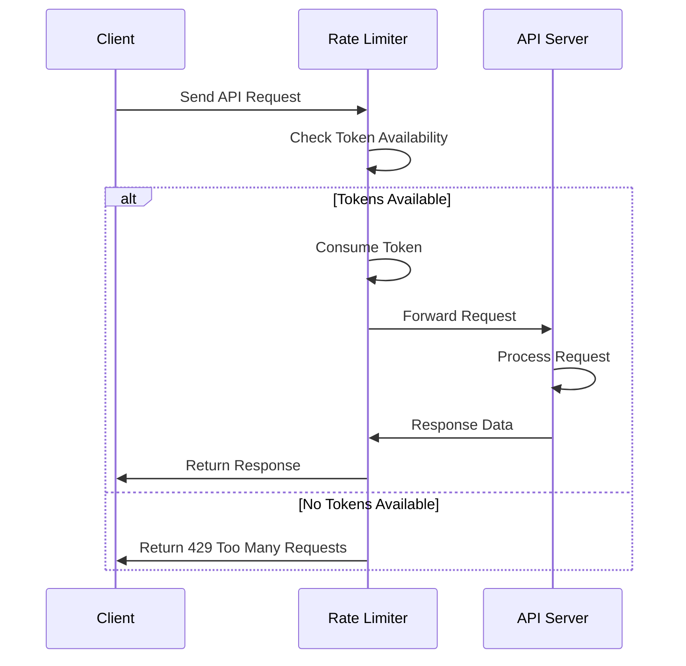
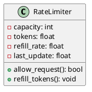
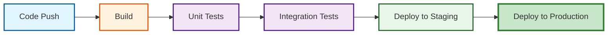

# API Rate Limiting System - Technical Specification

Generated by Jotty Multi-Agent System (Claude CLI + DRY-Refactored Experts)

## 1. Algorithm

Token Bucket Algorithm:

$$
\text{tokens} = \min\left(\text{capacity}, \text{current\_tokens} + (\text{now} - \text{last\_update}) \times \text{refill\_rate}\right)
$$

## 2. Request Flow


```

## 3. Class Model


```

## 4. CI/CD Pipeline


```

---

*Generated using:*
- Claude CLI (via DSPy)
- Jotty Multi-Agent System
- DRY-Refactored Expert Agents (BaseExpert pattern)
- 984 lines of duplicate code eliminated
