# 📁 Logging & ⏱️ Profiling Guide

## ✅ What's Now Available

### 1. File Logging (NEW)
Logs are now written to files in addition to console output.

### 2. Performance Profiling (NEW)
Track execution times to identify bottlenecks.

---

## 📁 File Logging

### What Gets Logged

#### Console (stdout) - Always Active
- Real-time execution progress
- Agent outputs
- Warnings and errors

#### File Logs - Configurable
```
./outputs/run_YYYYMMDD_HHMMSS/
├── logs/
│   ├── beautified.log    # Clean, human-readable
│   └── debug.log          # Detailed with line numbers
└── jotty_state/           # Persistent state (always created)
```

### Configuration

```python
from core import SwarmConfig

config = SwarmConfig(
    # Output directory
    output_base_dir="./outputs",
    create_run_folder=True,  # Creates timestamped folders

    # File logging
    enable_beautified_logs=True,  # Clean logs
    enable_debug_logs=True,        # Detailed logs
    log_level="INFO",              # DEBUG, INFO, WARNING, ERROR
)
```

### Log Formats

#### Beautified Log (logs/beautified.log)
```
08:45:01 | INFO     | ✅ Stored 'goal' in SharedContext
08:45:02 | INFO     | ✅ Resolving parameters for 'IssueDetector'
08:45:05 | INFO     | ✅ IssueDetector completed successfully
```

#### Debug Log (logs/debug.log)
```
2026-01-11 08:45:01 | INFO     | conductor:1806 | ✅ Stored 'goal' in SharedContext: Analyze code
2026-01-11 08:45:02 | DEBUG    | conductor:3901 | ✅ Resolving parameters for 'IssueDetector'
2026-01-11 08:45:05 | INFO     | conductor:4120 | ✅ IssueDetector completed successfully
```

### View Logs

```bash
# Beautified (clean)
cat ./outputs/run_*/logs/beautified.log

# Debug (detailed)
cat ./outputs/run_*/logs/debug.log

# Live tail
tail -f ./outputs/run_*/logs/beautified.log
```

---

## ⏱️ Performance Profiling

### What Gets Profiled

- **Agent execution time** - How long each agent takes
- **LLM calls** - Claude CLI subprocess time
- **Parameter resolution** - Time to resolve parameters
- **State persistence** - Time to save state

### Configuration

```python
config = SwarmConfig(
    enable_profiling=True,        # Enable profiling
    profiling_verbosity="summary" # "summary" or "detailed"
)
```

### Profiling Output Files

When profiling is enabled, Jotty generates comprehensive reports in `./outputs/run_*/profiling/`:

```
./outputs/run_YYYYMMDD_HHMMSS/profiling/
├── gantt_chart.mmd           # Mermaid Gantt chart
├── execution_timeline.txt    # ASCII timeline + component breakdown
├── profiling_report.md       # Markdown report with all visualizations
└── profiling_data.json       # Raw JSON data for programmatic analysis
```

### Console Output Example

```
======================================================================
⏱️  PERFORMANCE SUMMARY
======================================================================

📊 IssueDetector
   Count: 1
   Total: 3.45s
   Avg:   3.45s
   Range: 3.45s - 3.45s

📊 SolutionProvider
   Count: 1
   Total: 2.87s
   Avg:   2.87s
   Range: 2.87s - 2.87s
======================================================================

📊 Profiling reports available at:
   - Gantt Chart: ./outputs/run_20260111_091414/profiling/gantt_chart.mmd
   - Timeline Report: ./outputs/run_20260111_091414/profiling/execution_timeline.txt
   - Markdown Report: ./outputs/run_20260111_091414/profiling/profiling_report.md
   - JSON Data: ./outputs/run_20260111_091414/profiling/profiling_data.json
```

### Gantt Chart Visualization

The `gantt_chart.mmd` file contains Mermaid syntax for visualizing execution timeline:

```mermaid
gantt
    title Agent Execution Timeline
    dateFormat x
    axisFormat %M:%S.%L

    section Agent
    IssueDetector :1673429650000, 1673429656000
    SolutionProvider :1673429656000, 1673429663000
```



You can render this with any Mermaid-compatible viewer (GitHub, VS Code, etc.)

### Execution Timeline Report

The `execution_timeline.txt` contains:

1. **ASCII Gantt Chart** - Visual timeline showing when each component ran
2. **Component Breakdown** - Detailed timing statistics per component
3. **Optimization Recommendations** - AI-generated suggestions based on profiling data

Example:

```
============================================================
⏱️  EXECUTION TIMELINE (Gantt Chart)
============================================================
Total Duration: 7.32s

Timeline: |------------|------------|------------|------------|
          0s          1.8s         3.7s         5.5s         7.3s

Agent:
  IssueDetector              |      ████████ 3.45s
  SolutionProvider           |                  ██████ 2.87s

============================================================
📊 COMPONENT BREAKDOWN
============================================================

📦 Agent
   Count:      2
   Total:      6.32s
   Average:    3.16s
   Min:        2.87s
   Max:        3.45s
   % of Total: 86.3%
   Operations:
      - IssueDetector: 3.450s (3450ms)
      - SolutionProvider: 2.870s (2870ms)

============================================================
🎯 OPTIMIZATION RECOMMENDATIONS
============================================================

🤖 Agent Execution:
   Average time: 3.16s
   ✅ Normal range for Sonnet model (3-4s per agent)

📈 Overall Analysis:
   Total execution: 7.32s
   Agent time: 6.32s (86.3%)
   Overhead: 1.00s (13.7%)
   ✅ Orchestration overhead is reasonable (<20%)
============================================================
```

### Interpreting Results

**Typical Breakdown for Two-Agent System:**
```
Agent.IssueDetector    →  3.5s  (50%)  ← Claude CLI call
Agent.SolutionProvider →  3.0s  (43%)  ← Claude CLI call
Parameter Resolution   →  0.1s  (1%)
State Persistence      →  0.4s  (6%)
────────────────────────────────────
Total                     7.0s  (100%)
```

### Performance Insights

#### 🐌 Slow (What's Normal)
- **Claude CLI calls: 2-4 seconds each**
  - This is Claude processing time, not our code
  - Each agent = 1 CLI call = 2-4 seconds
  - Two agents = 4-8 seconds total

#### ⚡ Fast (Should Be Quick)
- **Parameter resolution: < 100ms**
- **State persistence: < 500ms**
- **Conductor overhead: < 50ms**

#### 🚩 Red Flags (Investigate)
- Parameter resolution > 500ms → Too many lookups
- State persistence > 1s → Large state, optimize
- Conductor overhead > 200ms → Bug in orchestration

---

## 🚀 Complete Example

```python
import asyncio
from core import SwarmConfig, AgentSpec, Conductor
import dspy

async def main():
    # Configure
    config = SwarmConfig(
        # Logging
        enable_beautified_logs=True,
        enable_debug_logs=True,
        log_level="INFO",

        # Profiling
        enable_profiling=True,
        profiling_verbosity="summary",

        # Output
        output_base_dir="./outputs",
        create_run_folder=True
    )

    # Create agents
    detector = AgentSpec(
        name="CodeAnalyzer",
        agent=dspy.ChainOfThought(AnalyzeSignature),
        outputs=["issues"]
    )

    # Run
    conductor = Conductor(
        actors=[detector],
        metadata_provider=None,
        config=config
    )

    result = await conductor.run(
        goal="Analyze code",
        code="def foo(): pass"
    )

    # Logs written to: ./outputs/run_YYYYMMDD_HHMMSS/logs/
    # Profiling summary printed to console

asyncio.run(main())
```

---

## 📊 What Gets Saved

### Always Saved (Persistent State)
```
./outputs/run_YYYYMMDD_HHMMSS/jotty_state/
├── brain_state/                          # Agent learning state
├── episode_history/                      # Execution history
├── markovian_todos/                      # Task state
├── memories/                             # Agent memories
└── q_tables/                             # Q-learning tables
```

### Optional (File Logs)
```
./outputs/run_YYYYMMDD_HHMMSS/logs/
├── beautified.log   # If enable_beautified_logs=True
└── debug.log        # If enable_debug_logs=True
```

---

## 🎯 Common Use Cases

### 1. Production (Logging Enabled, No Profiling)
```python
config = SwarmConfig(
    enable_beautified_logs=True,
    enable_debug_logs=False,  # Less disk space
    enable_profiling=False,   # No overhead
    log_level="INFO"
)
```

### 2. Development (Full Logging + Profiling)
```python
config = SwarmConfig(
    enable_beautified_logs=True,
    enable_debug_logs=True,
    enable_profiling=True,
    profiling_verbosity="summary",
    log_level="DEBUG"
)
```

### 3. Performance Investigation
```python
config = SwarmConfig(
    enable_beautified_logs=False,  # Less noise
    enable_debug_logs=False,
    enable_profiling=True,         # Focus on timing
    profiling_verbosity="detailed",
    log_level="WARNING"
)
```

### 4. Quick Test (Console Only)
```python
config = SwarmConfig(
    enable_beautified_logs=False,
    enable_debug_logs=False,
    enable_profiling=False,
    enable_rl=False
)
# Everything goes to console, minimal disk writes
```

---

## ⏱️ Expected Performance

### Simple Two-Agent System
```
Agent 1 (IssueDetector):    3.5s  (Claude CLI)
Agent 2 (SolutionProvider): 3.0s  (Claude CLI)
Parameter resolution:       0.1s
State persistence:          0.4s
──────────────────────────────────
Total:                      7.0s
```

### Complex Four-Agent System
```
Agent 1:  3.5s
Agent 2:  3.2s (uses Agent 1 output)
Agent 3:  3.8s (uses Agent 2 output)
Agent 4:  3.1s (uses Agent 3 output)
Overhead: 0.5s
──────────────────────────────────
Total:   14.1s
```

**95% of time = Claude CLI processing**
**5% of time = Jotty orchestration**

---

## 💡 Performance Tips

### 1. Use Haiku for Testing
```python
lm = ClaudeCLILM(model="haiku")  # Faster (1-2s vs 3-4s)
```

### 2. Disable RL for Simple Tasks
```python
config = SwarmConfig(enable_rl=False)  # Saves ~100ms
```

### 3. Reduce Logging Verbosity
```python
config = SwarmConfig(log_level="WARNING")  # Less I/O
```

### 4. Batch Agent Calls (When Possible)
Design agents to do more work in fewer calls.

---

## 🎉 Summary

✅ **File logging**: Logs saved to `./outputs/run_*/logs/`
✅ **Profiling**: Execution times tracked and summarized
✅ **State persistence**: Always saved to `./outputs/run_*/jotty_state/`
✅ **Console output**: Real-time progress always visible

**Result**: Full visibility into system execution and performance! 🚀
