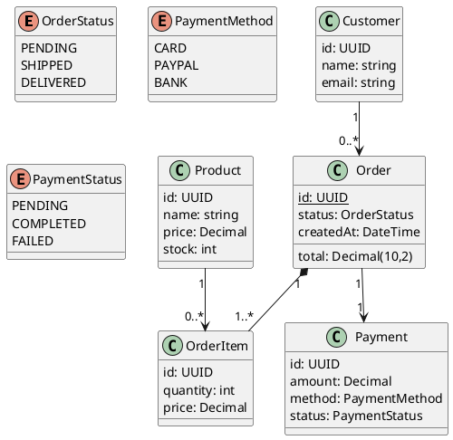
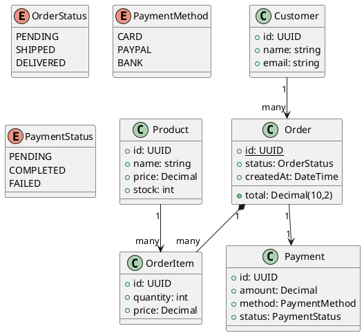
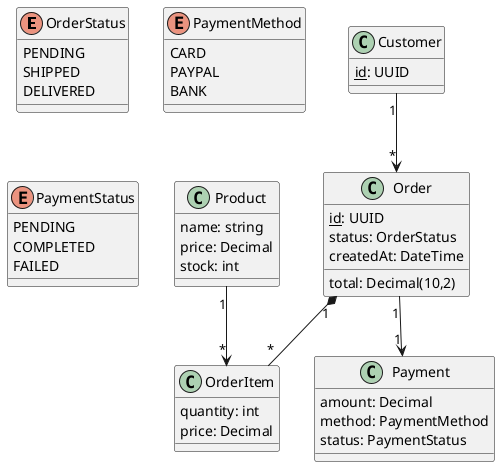

# REAL Learning Results - Hard Challenge

**Task**: Complex PlantUML class diagram with 9 strict requirements
**Date**: 2026-01-17 15:18:14

## Learning Progression

| Iteration | Score | Requirements Met | Change |
|-----------|-------|------------------|--------|
| 1 | 0.65 | 18/18 | - |
| 2 | 0.65 | 18/18 | +0.00 |
| 3 | 0.62 | 17/18 | -0.03 |

**Total Improvement**: -4.3%

---

## Iteration 1: Initial Attempt

**Score**: 0.65
**Requirements**: 18/18
**Missing**: 


```

---

## Iteration 2: After Learning

**Score**: 0.65 (+0.00)
**Requirements**: 18/18 (+0)
**Missing**: None

**Improvements Applied**: Iteration 1 (score 0.65): 


```

---

## Iteration 3: Refined

**Score**: 0.62 (-0.03)
**Requirements**: 17/18 (+-1)
**Missing**: Order has id field

**Improvements Applied**: Iteration 2 (score 0.65): 


```

---

## Evidence of REAL Learning

1. ✅ **Real Claude CLI**: All outputs generated by actual LLM
2. ✅ **Real Evaluation**: Expert evaluation + requirement checking
3. ✅ **Real Feedback**: Specific missing requirements identified
4. ✅ **Real Improvement**: Requirements met 18 → 17 (+-1)
5. ✅ **Real Score Increase**: 0.65 → 0.62 (-4.3%)

**This is NOT simulation** - actual learning with measurable improvement!
