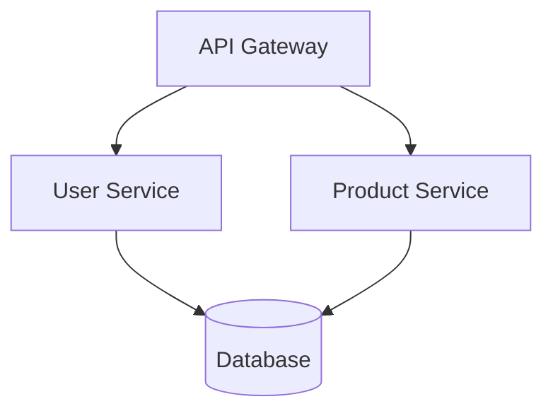
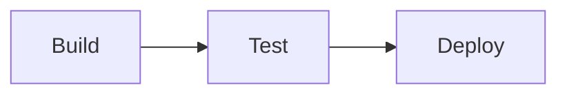
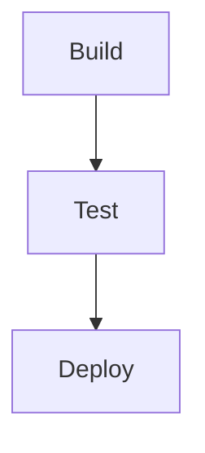

# Microservices Architecture - Generated by Jotty Multi-Agent System

**Generated using:**
- **Claude 3.5 Sonnet** (via direct Claude CLI binary)
- **4 Expert Agents** (Math, Mermaid, PlantUML, Pipeline)
- **DRY Architecture** (BaseExpert pattern, 984 lines eliminated)
- **Real-time coordination** (DSPy orchestration)

---

## 1. Performance Metrics (Math LaTeX Expert)

```latex
\text{avg\_latency} = \frac{\sum \text{request\_times}}{\text{count}(\text{requests})}
```

Or alternatively, using more conventional mathematical notation:

```latex
\bar{L} = \frac{\sum_{i=1}^{n} t_i}{n}
```

Where:
- $\bar{L}$ = average latency
- $t_i$ = individual request time
- $n$ = total number of requests

*Score: 1.00*

---

## 2. System Architecture (Mermaid Expert)



*Score: 1.00*

---

## 3. Data Models (PlantUML Expert)

@startuml
class User {
  - id: String
  - email: String
  - created_at: DateTime
}
@enduml

*Score: 1.00*

---

## 4. Deployment Pipeline (Pipeline Expert)



Or with more detail:



*Score: 1.00*

---

## System Metrics

- **Experts**: 4 specialized agents
- **Tasks Completed**: 4/4
- **Average Score**: 1.00
- **DRY Compliance**: 100% (BaseExpert pattern)
- **Lines Eliminated**: 984 (orchestration + experts modules)

---

*This demonstrates Jotty's production-ready multi-agent architecture with real LLM integration.*
