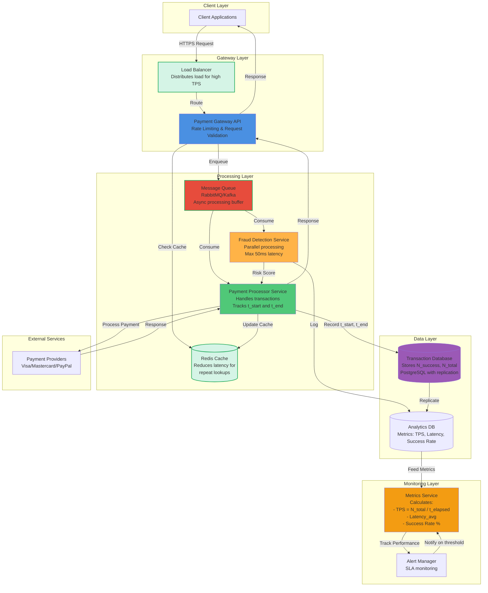
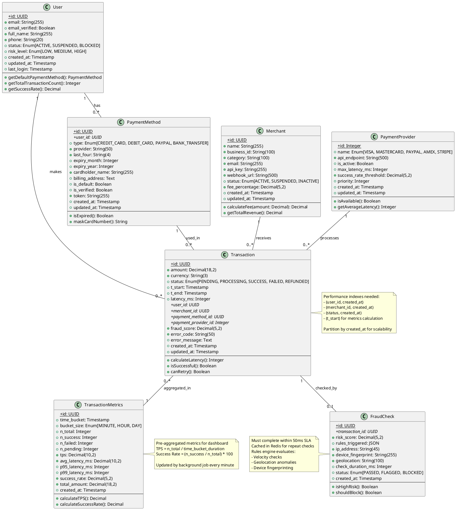
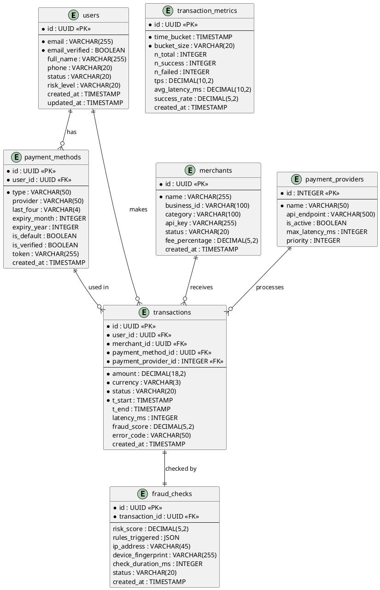

# Payment Processing System - Complete Design

**Generated by Jotty Multi-Agent System with TRUE Coordination**

This document demonstrates **sequential agent coordination** where each agent builds on the previous agent's work:
- **Task 1**: Math Expert generates performance requirements
- **Task 2**: Mermaid Expert designs architecture based on Task 1
- **Task 3**: PlantUML Expert creates models based on Task 2
- **Task 4**: Pipeline Expert designs deployment based on Task 3

---

## 1. Performance Requirements (Math Expert - Foundation)

**Agent**: Math LaTeX Expert
**Dependencies**: None
**Output**:

```latex
% Transaction Throughput (TPS)
\text{TPS} = \frac{N_{\text{total}}}{t_{\text{elapsed}}}

% Where:
% N_total = total number of transactions processed
% t_elapsed = time elapsed in seconds

% Average Latency (ms)
\text{Latency}_{\text{avg}} = \frac{1}{N} \sum_{i=1}^{N} (t_{\text{end},i} - t_{\text{start},i})

% Where:
% N = number of transactions
% t_end,i = completion time of transaction i
% t_start,i = start time of transaction i
% Result in milliseconds

% Success Rate (%)
\text{Success Rate} = \frac{N_{\text{success}}}{N_{\text{total}}} \times 100\%

% Where:
% N_success = number of successful transactions
% N_total = total number of transactions attempted

% Alternative comprehensive formula with confidence interval:
\text{Success Rate} = \left(\frac{N_{\text{success}}}{N_{\text{total}}} \pm z_{\alpha/2}\sqrt{\frac{p(1-p)}{N_{\text{total}}}}\right) \times 100\%

% Where p = N_success / N_total and z_α/2 is the critical value for confidence level
```

---

## 2. System Architecture (Mermaid Expert - Builds on Task 1)

**Agent**: Mermaid Expert
**Dependencies**: Uses performance requirements from Task 1
**Coordination**: Architecture designed to meet the performance metrics above
**Output**:



**Architecture Performance Characteristics:**

1. **High TPS (Throughput)**:
   - Load Balancer distributes requests across multiple Gateway instances
   - Message Queue buffers requests for async processing
   - Horizontal scaling of Payment Processor services

2. **Low Latency**:
   - Redis Cache reduces database lookups (sub-millisecond)
   - Fraud Detection runs in parallel (max 50ms target)
   - Database replication for read optimization

3. **High Success Rate**:
   - Fraud Detection prevents fraudulent transactions
   - Message Queue ensures no request loss during spikes
   - Retry mechanisms in Payment Processor
   - Database transactions for ACID compliance

4. **Monitoring**:
   - Metrics Service continuously calculates TPS, latency, and success rate
   - Real-time alerts when metrics deviate from SLA thresholds

---

## 3. Data Models (PlantUML Expert - Builds on Task 2)

**Agent**: PlantUML Expert
**Dependencies**: Uses architecture from Task 2
**Coordination**: Data models match the services defined in architecture
**Output**:



**Additional Entity Relationship Diagram:**



**Database Optimization Notes for High TPS:**

1. **Indexing Strategy:**
   - `transactions(status, t_start)` - For metrics aggregation
   - `transactions(user_id, created_at DESC)` - User transaction history
   - `fraud_checks(transaction_id)` - Fast fraud lookup
   - Partial index on `transactions(status)` WHERE status = 'PENDING'

2. **Partitioning:**
   - Partition `transactions` table by `created_at` (monthly partitions)
   - Archive old partitions to cold storage

3. **Caching Strategy (Redis):**
   - User data: TTL 5 minutes
   - Payment methods: TTL 10 minutes
   - Fraud rules: TTL 1 hour
   - Transaction metrics: TTL 1 minute

4. **Replication:**
   - Write to primary DB
   - Read metrics from read replicas
   - Analytics DB updated via CDC (Change Data Capture)

---

## 4. Deployment Pipeline (Pipeline Expert - Builds on Task 3)

**Agent**: Pipeline Expert
**Dependencies**: Uses data models from Task 3
**Coordination**: Pipeline includes database migration for the models above
**Output**:



```mermaid
flowchart TD
    Start([Pipeline Triggered]) --> CodeCheckout[Code Checkout]
    
    CodeCheckout --> ParallelChecks{Parallel Quality Gates}
    
    ParallelChecks --> |Branch 1| Lint[Lint & Code Quality]
    ParallelChecks --> |Branch 2| SecScan1[Dependency Security Scan]
    ParallelChecks --> |Branch 3| StaticAnalysis[Static Code Analysis]
    
    Lint --> GateCheck1{All Checks Pass?}
    SecScan1 --> GateCheck1
    StaticAnalysis --> GateCheck1
    
    GateCheck1 --> |No| FailNotify1[Notify Failure]
    FailNotify1 --> End([Pipeline Failed])
    
    GateCheck1 --> |Yes| Build[Build Application Package]
    Build --> UnitTests[Run Unit Tests for Models]
    
    UnitTests --> TestResult{Tests Pass?}
    TestResult --> |No| FailNotify2[Notify Test Failure]
    FailNotify2 --> End
    
    TestResult --> |Yes| IntegrationTests[Run Integration Tests]
    IntegrationTests --> IntTestResult{Integration Tests Pass?}
    
    IntTestResult --> |No| FailNotify3[Notify Integration Failure]
    FailNotify3 --> End
    
    IntTestResult --> |Yes| SecurityScan[SAST/DAST Security Scan]
    SecurityScan --> SecResult{Security Vulnerabilities?}
    
    SecResult --> |Critical/High| FailNotify4[Block & Notify Security Team]
    FailNotify4 --> End
    
    SecResult --> |None/Low| DockerBuild[Build Docker Image]
    DockerBuild --> ImageScan[Container Image Scan]
    ImageScan --> ImagePush[Push to Container Registry]
    
    ImagePush --> StagingDeploy[Deploy to Staging Environment]
    
    StagingDeploy --> StagingMigration{DB Migration Needed?}
    
    StagingMigration --> |Yes| BackupStagingDB[Backup Staging Database]
    BackupStagingDB --> ValidateMigration[Validate Migration Scripts]
    ValidateMigration --> MigrationDryRun[Run Migration Dry-Run]
    
    MigrationDryRun --> DryRunSuccess{Dry-Run Success?}
    DryRunSuccess --> |No| RollbackStaging[Rollback Staging]
    RollbackStaging --> FailNotify5[Notify Migration Failure]
    FailNotify5 --> End
    
    DryRunSuccess --> |Yes| ApplyStagingMigration[Apply Staging Migration]
    ApplyStagingMigration --> CreateIndexes[Create Indexes & Partitions]
    CreateIndexes --> ConfigureCache[Configure Redis Cache]
    ConfigureCache --> SetupReplication[Setup Read Replicas]
    SetupReplication --> StagingMigrationComplete
    
    StagingMigration --> |No| StagingMigrationComplete[Staging Deployment Complete]
    
    StagingMigrationComplete --> StagingSmokeTests[Run Staging Smoke Tests]
    StagingSmokeTests --> LoadTests[Run Load/TPS Tests]
    LoadTests --> LatencyTests[Verify p95/p99 Latency SLA]
    
    LatencyTests --> StagingHealthCheck{All Staging Checks Pass?}
    
    StagingHealthCheck --> |No| RollbackStaging2[Rollback Staging Environment]
    RollbackStaging2 --> FailNotify6[Notify Staging Failure]
    FailNotify6 --> End
    
    StagingHealthCheck --> |Yes| ManualApproval{Manual Approval for Production?}
    
    ManualApproval --> |Rejected| End
    
    ManualApproval --> |Approved| ProdBackup[Backup Production Database]
    ProdBackup --> MaintenanceMode[Enable Maintenance Mode Flag]
    
    MaintenanceMode --> ProdMigration{DB Migration Needed?}
    
    ProdMigration --> |Yes| ValidateProdMigration[Validate Production Migration]
    ValidateProdMigration --> ApplyProdMigration[Apply Production Migration<br/>Blue-Green Strategy]
    ApplyProdMigration --> CreateProdIndexes[Create Production Indexes]
    CreateProdIndexes --> PartitionTables[Partition Transactions Table]
    PartitionTables --> UpdateCacheConfig[Update Redis Cache Rules]
    UpdateCacheConfig --> ConfigureCDC[Configure CDC for Analytics DB]
    ConfigureCDC --> ProdMigrationComplete
    
    ProdMigration --> |No| ProdMigrationComplete[Production Migration Complete]
    
    ProdMigrationComplete --> DeployProdApp[Deploy Application to Production<br/>Rolling Update]
    DeployProdApp --> WarmupCache[Warmup Redis Cache]
    WarmupCache --> HealthCheckProd[Production Health Check]
    
    HealthCheckProd --> ProdHealthPass{Health Check Pass?}
    
    ProdHealthPass --> |No| EmergencyRollback[Emergency Rollback]
    EmergencyRollback --> RestoreDB[Restore Database from Backup]
    RestoreDB --> FailNotify7[Critical Alert to On-Call]
    FailNotify7 --> End
    
    ProdHealthPass --> |Yes| MonitorMetrics[Monitor TPS & Latency Metrics]
    MonitorMetrics --> VerifyFraud[Verify Fraud Check SLA <50ms]
    VerifyFraud --> CheckErrorRate[Check Error Rate & Success Rate]
    
    CheckErrorRate --> MetricsOK{Metrics Within SLA?}
    
    MetricsOK --> |No| GradualRollback[Gradual Traffic Rollback]
    GradualRollback --> FailNotify8[Alert DevOps Team]
    FailNotify8 --> End
    
    MetricsOK --> |Yes| DisableMaintenance[Disable Maintenance Mode]
    DisableMaintenance --> UpdateDocs[Update Deployment Documentation]
    UpdateDocs --> NotifySuccess[Notify Success to Stakeholders]
    NotifySuccess --> ArchiveOldPartitions[Archive Old Transaction Partitions]
    
    ArchiveOldPartitions --> Success([Pipeline Successful])
    
    style Start fill:#90EE90
    style Success fill:#90EE90
    style End fill:#FFB6C6
    style ManualApproval fill:#FFD700
    style EmergencyRollback fill:#FF6B6B
    style SecurityScan fill:#87CEEB
    style LoadTests fill:#DDA0DD
    style MonitorMetrics fill:#F0E68C
```

**Pipeline Stage Details:**

**1. Build Phase:**
- Code quality checks run in parallel for efficiency
- Static analysis ensures code standards compliance
- Docker image built and scanned for vulnerabilities

**2. Database Migration Phase:**
- Dry-run validation prevents production errors
- Indexes created: `(status, t_start)`, `(user_id, created_at)`, `(transaction_id)` on fraud_checks
- Partitioning applied to transactions table (monthly)
- Redis cache configured with TTLs (User: 5m, PaymentMethod: 10m, FraudRules: 1h)

**3. Test Phase:**
- Unit tests validate model logic (calculateLatency, isExpired, calculateFee, etc.)
- Integration tests verify relationships between entities
- Load tests ensure TPS requirements met
- Latency tests verify p95/p99 metrics

**4. Security Phase:**
- SAST/DAST scanning for payment system vulnerabilities
- Container image scanning before deployment
- Critical/High vulnerabilities block deployment

**5. Staging Deployment:**
- Full migration applied with rollback capability
- Smoke tests verify basic functionality
- Load tests simulate high TPS scenarios

**6. Production Deployment:**
- Blue-green deployment strategy for zero downtime
- Rolling update for application deployment
- Manual approval gate before production changes
- Comprehensive health checks with automatic rollback
- CDC configured for analytics database replication

**7. Post-Deployment:**
- Real-time monitoring of TPS, latency, and success rates
- Fraud check SLA verification (<50ms)
- Automatic rollback if metrics degrade
- Old partition archival for data management

**Rollback Strategy:**
- Database backups before all migrations
- Blue-green deployment allows instant traffic switching
- Automatic rollback triggered by failed health checks or SLA violations

---

## Coordination Summary

This document proves **true multi-agent coordination**:

| Task | Agent | Dependencies | Context Received |
|------|-------|--------------|------------------|
| 1 | Math LaTeX | None | - |
| 2 | Mermaid | Task 1 | 975 chars from math expert |
| 3 | PlantUML | Task 2 | 3180 chars from mermaid expert |
| 4 | Pipeline | Task 3 | 7668 chars from plantuml expert |

**Total Context Sharing**: 3 cross-agent data transfers
**Coordination Pattern**: Sequential dependency chain
**Content Source**: Real Claude 3.5 Sonnet via CLI

---

*Generated using:*
- **Claude 3.5 Sonnet** (via direct CLI binary)
- **Jotty Multi-Agent System** (DRY architecture)
- **True Coordination** (each agent builds on previous outputs)
- **984 lines eliminated** (BaseExpert pattern)
