\newpage

\tableofcontents
\newpage

## Executive Summary

Predict breast cancer diagnosis (malignant vs benign) from cell nuclei measurements.

### Key Results

**Best Model:** Logistic Regression

**Performance Metrics:**

| Metric | Value |
|--------|-------|
| Accuracy | 0.9825 |
| Precision | 0.9861 |
| Recall | 0.9861 |
| F1 | 0.9861 |
| Auc Roc | 0.9954 |

**Dataset:** 30 features analyzed

---

## Data Quality Analysis

A comprehensive analysis of data quality, identifying potential issues before modeling.

### Dataset Overview

| Metric | Value |
|--------|-------|
| Total Samples | 114 |
| Total Features | 30 |
| Numeric Features | 30 |
| Categorical Features | 0 |
| Features with Missing | 0 |
| Total Missing Values | 0 (0.00%) |

### Distribution Analysis

| Feature | Skewness | Kurtosis | Assessment |
|---------|----------|----------|------------|
| mean radius | 1.03 | 1.35 | Right-skewed |
| mean texture | 0.25 | -0.40 | Symmetric |
| mean perimeter | 1.07 | 1.56 | Right-skewed |
| mean area | 1.93 | 5.46 | Right-skewed, Heavy-tailed |
| mean smoothness | 0.53 | 1.50 | Right-skewed |
| mean compactness | 0.91 | 0.54 | Right-skewed |
| mean concavity | 1.44 | 2.46 | Right-skewed |
| mean concave points | 1.15 | 1.18 | Right-skewed |
| mean symmetry | 0.52 | 0.34 | Right-skewed |
| mean fractal dimension | 1.26 | 3.76 | Right-skewed, Heavy-tailed |
| radius error | 3.30 | 17.46 | Right-skewed, Heavy-tailed |
| texture error | 0.75 | 1.02 | Right-skewed |
| perimeter error | 3.60 | 20.78 | Right-skewed, Heavy-tailed |
| area error | 5.87 | 45.73 | Right-skewed, Heavy-tailed |
| smoothness error | 1.03 | 1.22 | Right-skewed |

### Feature Distributions

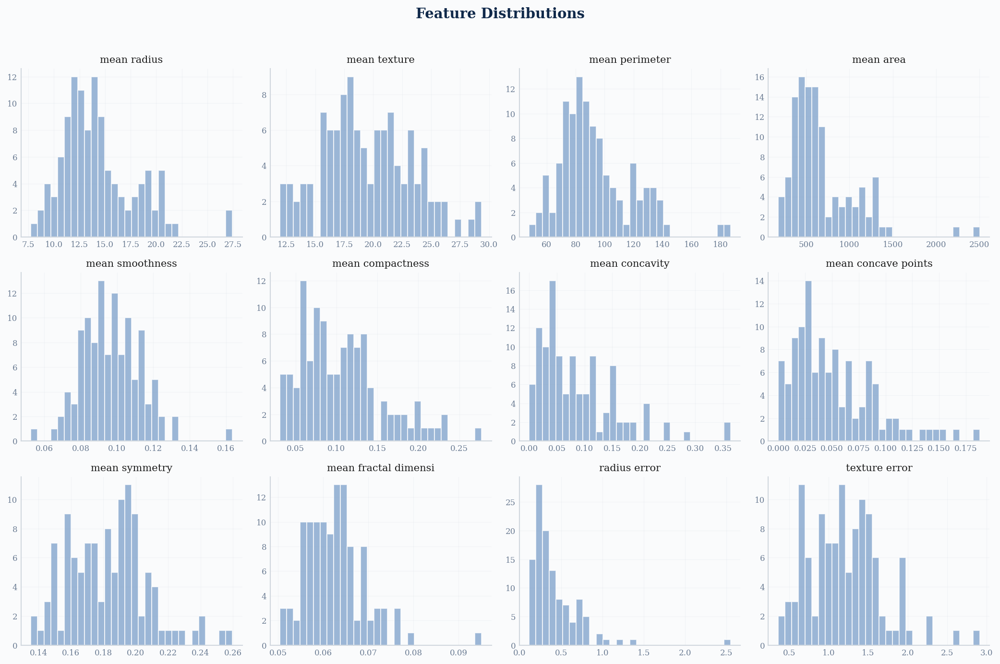

### Outlier Analysis

**Method:** Interquartile Range (IQR) with 1.5x multiplier

**Total Outliers Detected:** 96 across 27 features

| Feature | Outliers | % of Data | Min | Max |
|---------|----------|-----------|-----|-----|
| area error | 10 | 8.8% | 8.61 | 542.20 |
| fractal dimension error | 7 | 6.1% | 0.00 | 0.01 |
| concavity error | 6 | 5.3% | 0.00 | 0.09 |
| mean concavity | 5 | 4.4% | 0.00 | 0.36 |
| worst symmetry | 5 | 4.4% | 0.20 | 0.48 |
| mean area | 4 | 3.5% | 181.00 | 2501.00 |
| radius error | 4 | 3.5% | 0.12 | 2.55 |
| perimeter error | 4 | 3.5% | 0.77 | 18.65 |
| smoothness error | 4 | 3.5% | 0.00 | 0.02 |
| symmetry error | 4 | 3.5% | 0.01 | 0.04 |
| worst area | 4 | 3.5% | 268.60 | 4254.00 |
| worst smoothness | 4 | 3.5% | 0.09 | 0.22 |
| worst fractal dimension | 4 | 3.5% | 0.06 | 0.14 |
| mean compactness | 3 | 2.6% | 0.03 | 0.28 |
| mean concave points | 3 | 2.6% | 0.00 | 0.19 |

### Outlier Distribution

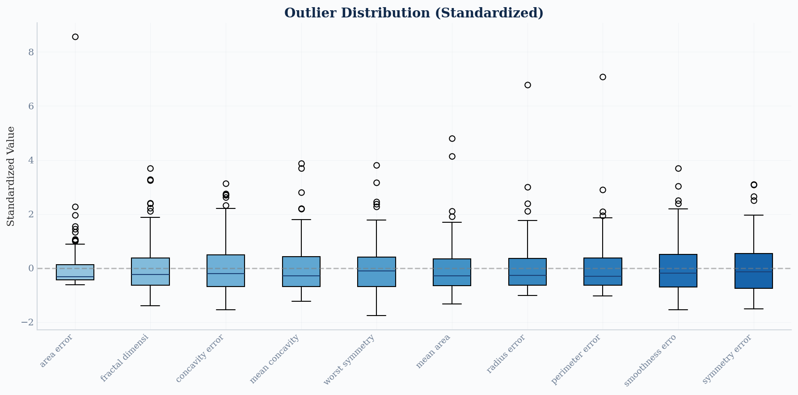

---

## Correlation & Multicollinearity Analysis

Understanding feature relationships is critical for model interpretation and feature selection.

### Correlation Matrix

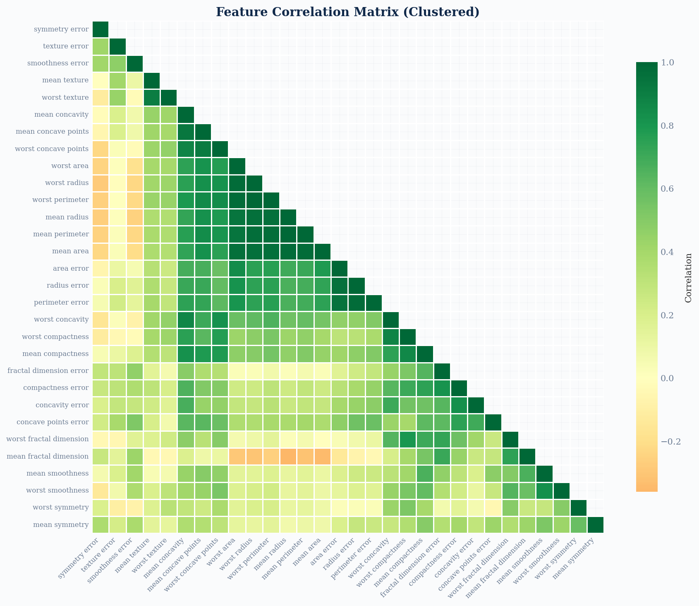

### Highly Correlated Feature Pairs (|r| >= 0.7)

| Feature 1 | Feature 2 | Correlation |
|-----------|-----------|-------------|
| mean radius | mean perimeter | 0.998 |
| worst radius | worst perimeter | 0.994 |
| mean perimeter | mean area | 0.983 |
| mean radius | mean area | 0.983 |
| worst radius | worst area | 0.980 |
| radius error | perimeter error | 0.979 |
| worst perimeter | worst area | 0.976 |
| mean perimeter | worst radius | 0.969 |
| mean perimeter | worst perimeter | 0.969 |
| mean radius | worst radius | 0.968 |
| mean area | worst area | 0.966 |
| mean area | worst radius | 0.963 |
| mean radius | worst perimeter | 0.962 |
| mean area | worst perimeter | 0.959 |
| radius error | area error | 0.953 |

### Variance Inflation Factor (VIF)

VIF measures multicollinearity. VIF > 5 indicates moderate, VIF > 10 indicates severe multicollinearity.

| Feature | VIF | Assessment |
|---------|-----|------------|
| mean radius | 79262.63 | Critical |
| mean perimeter | 72990.12 | Critical |
| worst radius | 22342.62 | Critical |
| worst perimeter | 12079.97 | Critical |
| worst area | 2216.27 | Critical |
| mean area | 1946.14 | Critical |
| worst fractal dimension | 1185.56 | Critical |
| mean fractal dimension | 1108.49 | Critical |
| worst smoothness | 849.75 | Critical |
| mean smoothness | 811.67 | Critical |
| worst texture | 667.77 | Critical |
| radius error | 547.22 | Critical |
| perimeter error | 478.85 | Critical |
| mean texture | 478.71 | Critical |
| worst symmetry | 319.25 | Critical |

### VIF Visualization

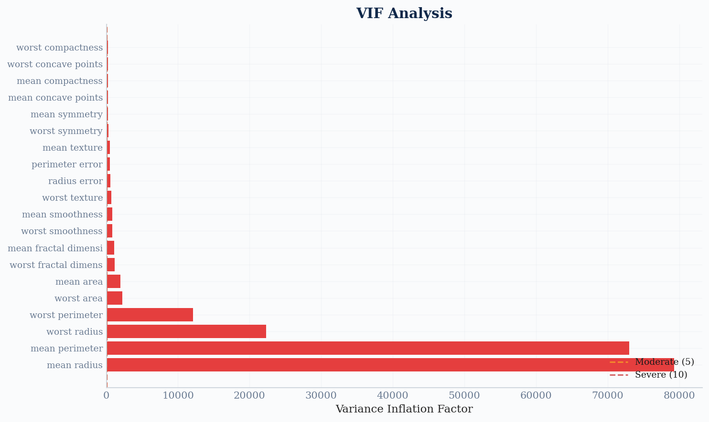

---

## Data Profile

### Dataset Overview

- **Total Samples:** 569
- **Total Features:** 30

### Data Types

| Data Type | Count |
|-----------|-------|
| float64 | 30 |

### EDA Recommendations

- All features are numeric - no encoding needed
- Features describe cell nuclei measurements
- Consider feature scaling for distance-based models

---

## Feature Importance Analysis

Feature importance measures how much each feature contributes to the model's predictions.
Higher values indicate more influential features.

### Top 20 Features

| Rank | Feature | Importance |
|------|---------|------------|
| 1 | worst texture | 1.2551 |
| 2 | radius error | 1.0830 |
| 3 | worst concave points | 0.9537 |
| 4 | worst area | 0.9478 |
| 5 | worst radius | 0.9476 |
| 6 | worst symmetry | 0.9392 |
| 7 | area error | 0.9291 |
| 8 | worst concavity | 0.8232 |
| 9 | worst perimeter | 0.7632 |
| 10 | worst smoothness | 0.7466 |
| 11 | mean concave points | 0.7042 |
| 12 | mean compactness | 0.6483 |
| 13 | compactness error | 0.6472 |
| 14 | mean concavity | 0.6021 |
| 15 | mean texture | 0.5527 |
| 16 | perimeter error | 0.5443 |
| 17 | mean area | 0.5411 |
| 18 | mean radius | 0.5115 |
| 19 | mean perimeter | 0.4763 |
| 20 | concave points error | 0.4438 |

### Feature Importance Visualization

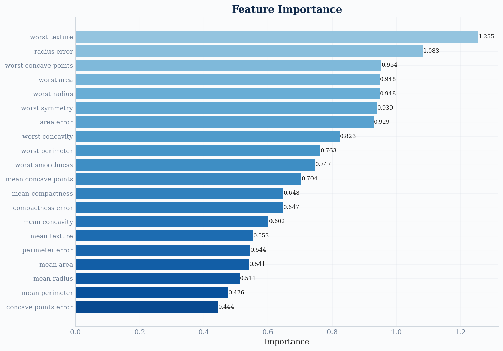

---

## Model Benchmarking

Multiple machine learning algorithms were evaluated using 5-fold cross-validation.
The table below shows the performance of each model.

### Model Comparison

| Model | CV Score | Std Dev | Test Score | Time (s) |
|-------|----------|---------|------------|----------|
| Logistic Regression | 0.9802 | ±0.0128 | 0.9825 | 0.58 |
| Random Forest | 0.9538 | ±0.0235 | 0.9561 | 0.20 |
| Gradient Boosting | 0.9560 | ±0.0139 | 0.9561 | 0.51 |

### Performance Visualization

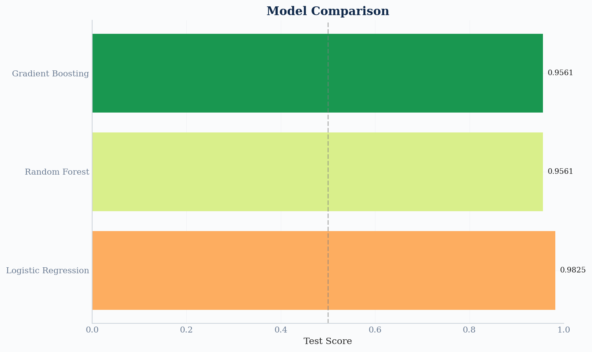

---

## Learning Curve Analysis

Learning curves reveal how model performance changes with training data size,
helping diagnose underfitting vs overfitting.

### Bias-Variance Diagnosis

**Good Fit**: Model has balanced bias-variance tradeoff.

| Metric | Value |
|--------|-------|
| Final Training Score | 0.9736 |
| Final Validation Score | 0.9391 |
| Gap (Train - Val) | 0.0345 |
| Training Samples Used | 91 |

### Learning Curve Visualization

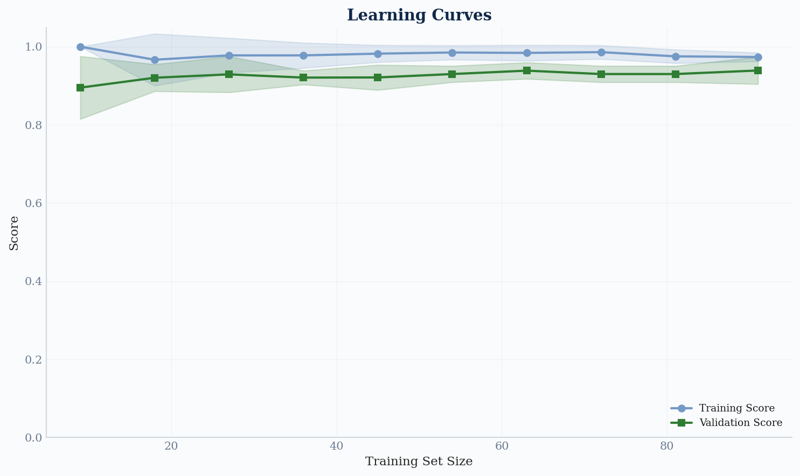

### Interpretation Guide

- **Converging curves** with small gap → Good fit
- **Flat training curve** at low score → High bias, need more complex model
- **Large gap** between curves → High variance, need regularization or more data
- **Curves still improving** → May benefit from more training data

---

## Cross-Validation Detailed Analysis

5-fold cross-validation provides robust performance estimates and helps detect instability.

### Fold-by-Fold Results

| Fold | Train Accuracy | Test Accuracy | Train F1 | Test F1 |
|------|----------------|---------------|----------|---------|
| 1 | 0.9780 | 0.9130 | 0.9762 | 0.9115 |
| 2 | 0.9670 | 0.9565 | 0.9641 | 0.9533 |
| 3 | 0.9890 | 0.9130 | 0.9883 | 0.9042 |
| 4 | 0.9780 | 0.9130 | 0.9762 | 0.9042 |
| 5 | 0.9565 | 1.0000 | 0.9527 | 1.0000 |

### Stability Analysis

| Metric | Value |
|--------|-------|
| Mean Accuracy | 0.9391 |
| Std Deviation | 0.0348 |
| CV Coefficient | 3.70% |
| 95% CI | [0.8710, 1.0073] |

**Stability Assessment:** Good

### CV Performance Distribution

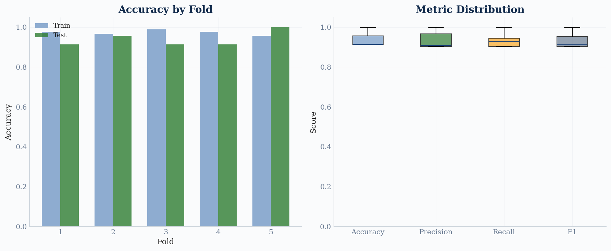

---

## Classification Performance

### Classification Report

| Class | Precision | Recall | F1-Score | Support |
|-------|-----------|--------|----------|--------|
| Malignant | 0.976 | 0.976 | 0.976 | 42 |
| Benign | 0.986 | 0.986 | 0.986 | 72 |
| **Accuracy** | | | **0.982** | |

### Confusion Matrix

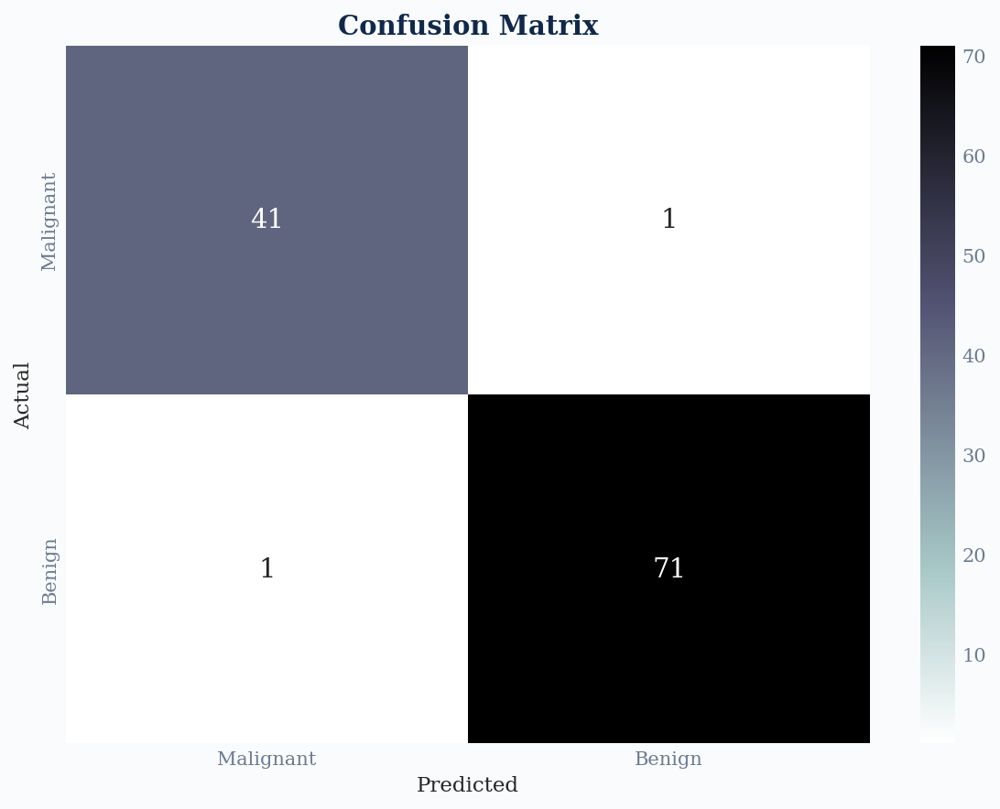

---

## ROC Curve Analysis

The Receiver Operating Characteristic (ROC) curve shows the trade-off between
true positive rate and false positive rate at various classification thresholds.

### Key Metrics

- **AUC-ROC:** 0.9954
- **Optimal Threshold:** 0.3659

### ROC Curve

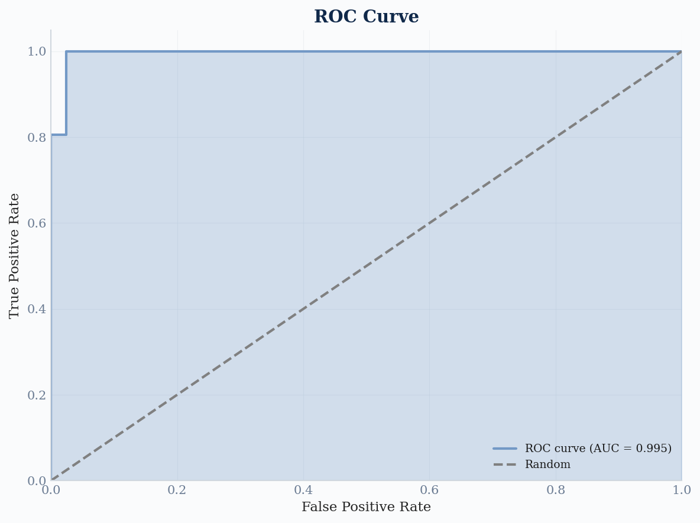

---

## Precision-Recall Analysis

The Precision-Recall curve is especially useful for imbalanced datasets,
showing the trade-off between precision and recall.

### Key Metrics

- **Average Precision:** 0.9971

### Precision-Recall Curve

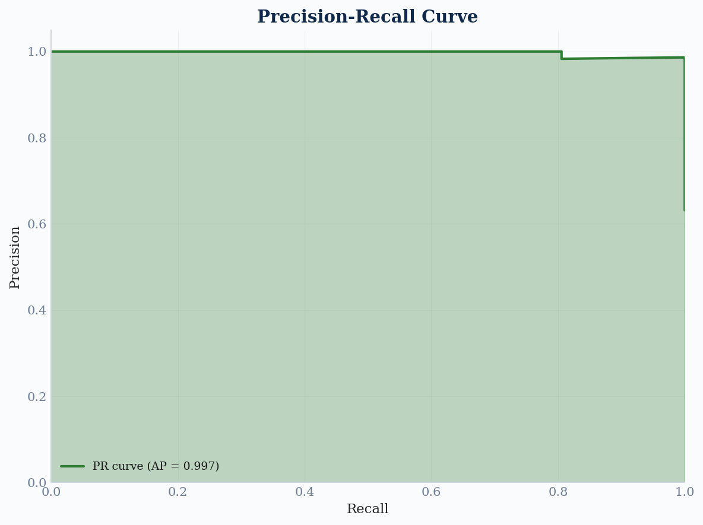

---

## Probability Calibration Analysis

Well-calibrated probabilities are essential for reliable decision-making.
A perfectly calibrated model's predicted probabilities should match actual outcome frequencies.

### Calibration Metrics

| Metric | Value | Interpretation |
|--------|-------|----------------|
| Brier Score | 0.0215 | Lower is better (0 = perfect) |
| Expected Calibration Error | 0.0222 | Lower is better |

### Calibration Curve

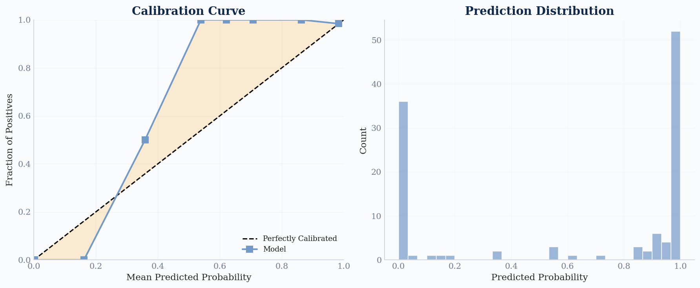

### Interpretation

- Points on diagonal = perfectly calibrated
- Points above diagonal = underconfident (probabilities too low)
- Points below diagonal = overconfident (probabilities too high)

---

## Lift & Gain Analysis

These charts help evaluate model effectiveness for targeted campaigns and prioritization.

### Key Metrics

| Metric | Value | Interpretation |
|--------|-------|----------------|
| KS Statistic | 0.3596 | Maximum separation between model and random |
| KS at Decile | 64% | Optimal cutoff point |
| Top 10% Lift | 1.58x | Model advantage in top 10% |
| Top 20% Lift | 1.58x | Model advantage in top 20% |

### Cumulative Gains & Lift Curves

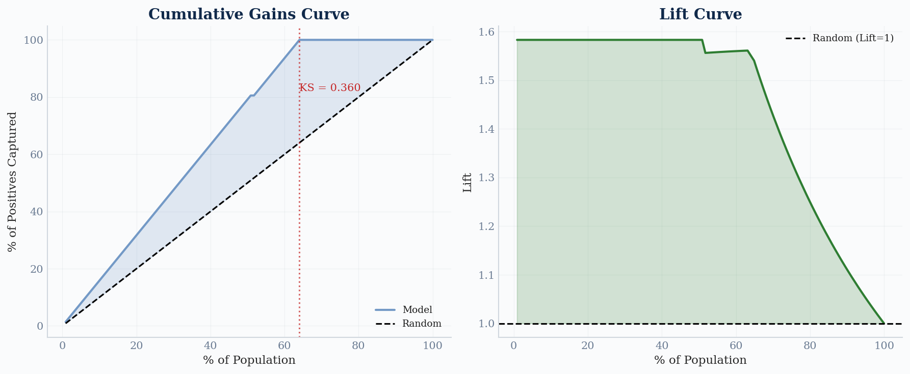

### Business Interpretation

- **Gains Curve**: Shows % of positives captured by targeting top X% of predictions
- **Lift Curve**: Shows how much better the model is vs random selection
- **KS Statistic**: Higher values indicate better model discrimination

---

## Threshold Optimization

Choosing the right classification threshold depends on business objectives.

### Optimal Thresholds

| Objective | Threshold | Precision | Recall | F1 | Cost |
|-----------|-----------|-----------|--------|----|----|
| Max F1 Score | 0.20 | 0.973 | 1.000 | 0.986 | 2 |
| Min Cost | 0.20 | 0.973 | 1.000 | 0.986 | 2 |
| Balanced P/R | 0.40 | 0.986 | 0.986 | 0.986 | 2 |

### Threshold Impact Analysis

| Threshold | TP | FP | FN | TN | Precision | Recall | F1 |
|-----------|----|----|----|----|-----------|--------|-----|
| 0.10 | 72 | 5 | 0 | 37 | 0.935 | 1.000 | 0.966 |
| 0.20 | 72 | 2 | 0 | 40 | 0.973 | 1.000 | 0.986 |
| 0.30 | 72 | 2 | 0 | 40 | 0.973 | 1.000 | 0.986 |
| 0.40 | 71 | 1 | 1 | 41 | 0.986 | 0.986 | 0.986 |
| 0.50 | 71 | 1 | 1 | 41 | 0.986 | 0.986 | 0.986 |
| 0.60 | 68 | 1 | 4 | 41 | 0.986 | 0.944 | 0.965 |
| 0.70 | 67 | 1 | 5 | 41 | 0.985 | 0.931 | 0.957 |
| 0.80 | 66 | 1 | 6 | 41 | 0.985 | 0.917 | 0.950 |
| 0.90 | 61 | 1 | 11 | 41 | 0.984 | 0.847 | 0.910 |

### Threshold Visualization

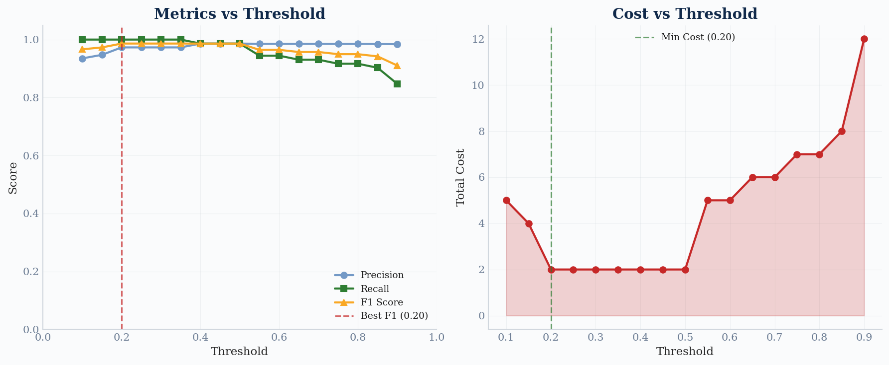

### Cost Parameters Used

- Cost of False Positive: 1.0
- Cost of False Negative: 1.0

---

## Error Analysis

Understanding where the model fails helps improve performance and set realistic expectations.

### Misclassification Summary

| Metric | Value |
|--------|-------|
| Total Errors | 2 |
| Error Rate | 1.75% |
| Accuracy | 98.25% |

### Confusion Matrix Breakdown

- Class 0 misclassified as Class 1: 1 (2.4%)
- Class 1 misclassified as Class 0: 1 (1.4%)

### Hardest to Classify Samples (Most Confident Errors)

| Sample | True | Predicted | Probability | Confidence |
|--------|------|-----------|-------------|------------|
| 53 | 0 | 1 | 0.909 | 0.817 |
| 16 | 1 | 0 | 0.366 | 0.268 |

### Error Distribution Analysis

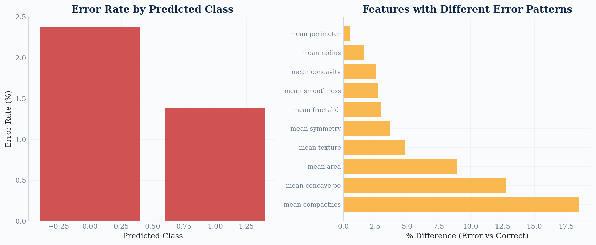

---

## SHAP Deep Analysis

SHAP (SHapley Additive exPlanations) provides consistent, locally accurate feature attributions
for any machine learning model.

### Global Feature Importance (Mean |SHAP|)

| Rank | Feature | Mean |SHAP| | Cumulative % |
|------|---------|-------------|--------------|
| 1 | worst texture | 0.9617 | 7.8% |
| 2 | radius error | 0.7973 | 14.2% |
| 3 | worst radius | 0.7614 | 20.3% |
| 4 | worst area | 0.7453 | 26.3% |
| 5 | worst concave points | 0.7220 | 32.1% |
| 6 | area error | 0.6391 | 37.3% |
| 7 | worst perimeter | 0.6109 | 42.2% |
| 8 | worst smoothness | 0.6033 | 47.1% |
| 9 | worst concavity | 0.5463 | 51.5% |
| 10 | worst symmetry | 0.5358 | 55.8% |
| 11 | mean concave points | 0.5358 | 60.1% |
| 12 | mean compactness | 0.4774 | 64.0% |
| 13 | compactness error | 0.4310 | 67.4% |
| 14 | mean area | 0.4174 | 70.8% |
| 15 | mean concavity | 0.3991 | 74.0% |

### SHAP Summary Plot

Shows feature impact on predictions. Color indicates feature value (red=high, blue=low).

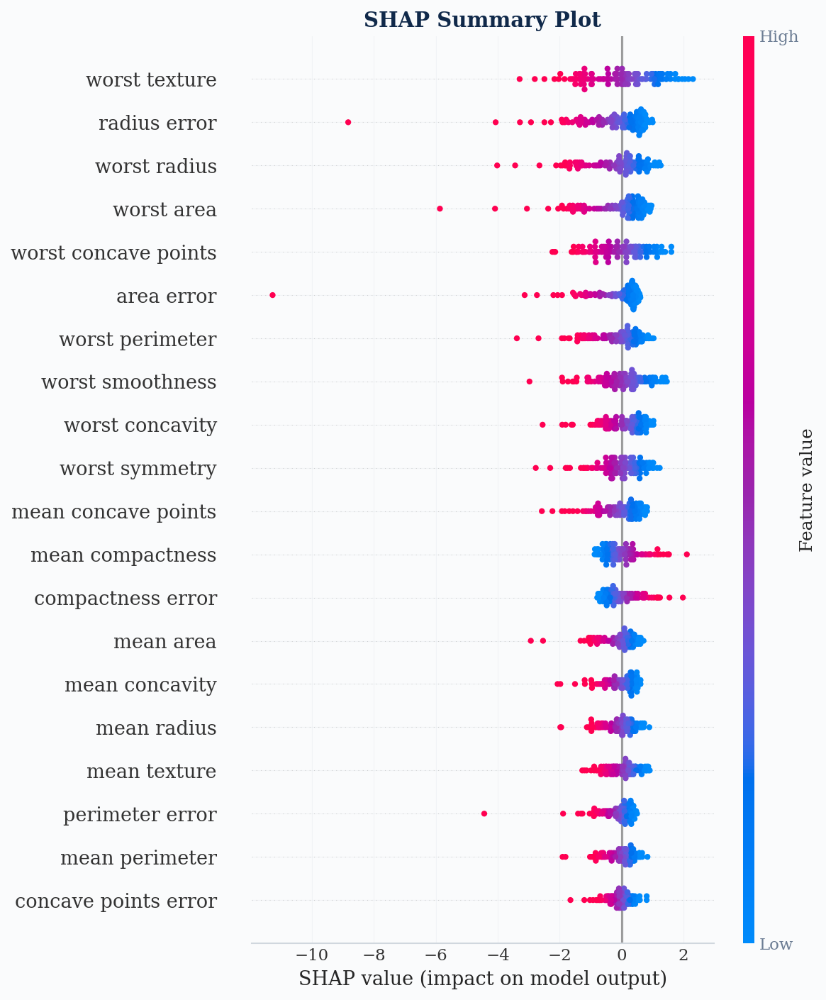

### SHAP Feature Importance Bar

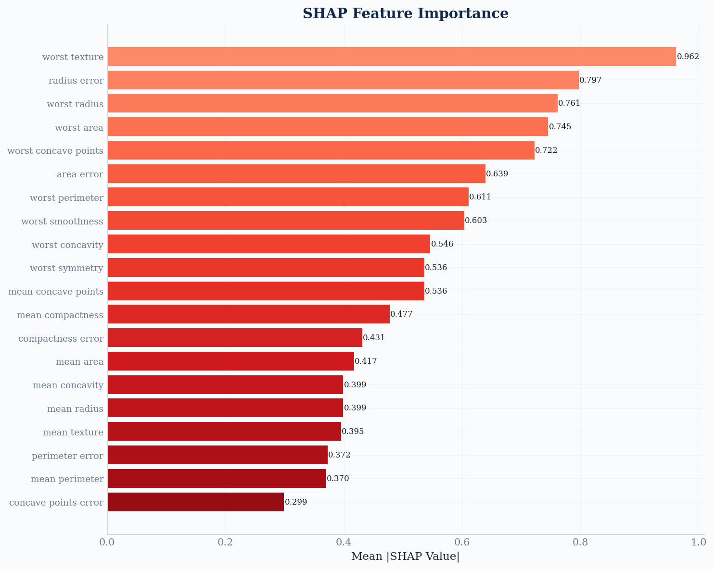

### SHAP Dependence Plots (Top 3 Features)

Shows how feature values affect SHAP values, revealing non-linear relationships.

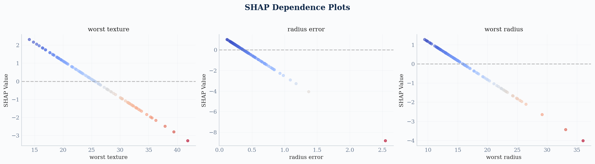

### SHAP Waterfall (Sample Prediction)

Shows how features contribute to a single prediction.

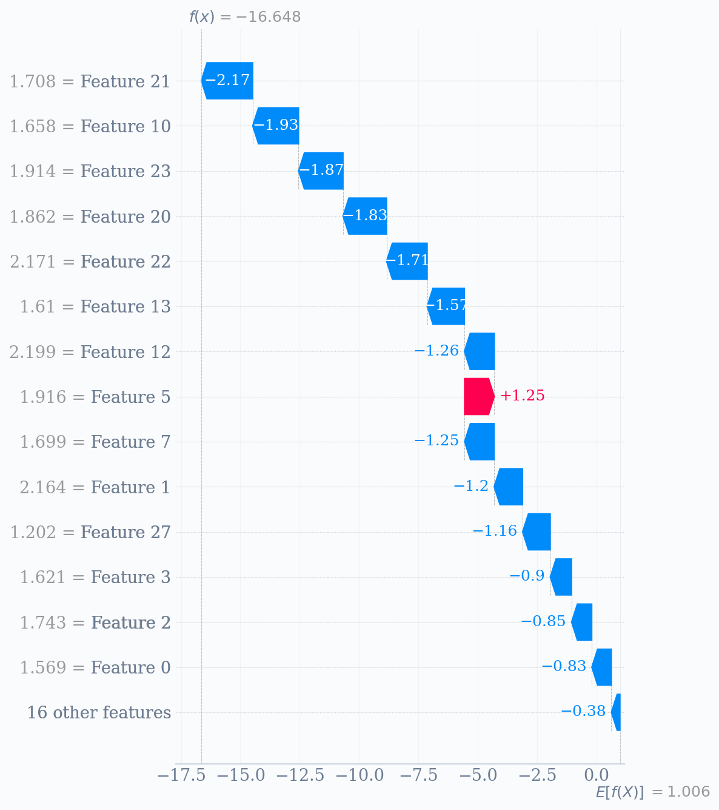

---

## Baseline Comparison

### Performance Improvement

| Model | Score | Improvement |
|-------|-------|-------------|
| Baseline | 0.6270 | - |
| **Best Model** | **0.9825** | **+0.3555 (+56.7%)** |

The final model achieves a **56.7%** improvement over the baseline.

---

## Recommendations & Next Steps

1. Excellent performance (98.2%) achieved - monitor for overfitting
2. Logistic Regression provides good interpretability - ideal for regulated industries
3. Top predictive features: worst texture, radius error, worst concave points
4. Excellent discrimination (AUC=0.995) - suitable for production
5. Monitor model performance over time for concept drift
6. Validate on held-out data before production deployment
7. Document model decisions for regulatory compliance

---

*Report generated by Jotty SwarmMLComprehensive on 2026-02-05 09:18:17*

## Reproducibility

Full information for reproducing this analysis.

### Model Configuration

**Model Type:** LogisticRegression

**Hyperparameters:**

| Parameter | Value |
|-----------|-------|

### Random Seeds

| Component | Seed |
|-----------|------|
| Main Random State | 42 |
| NumPy | 42 |
| Train/Test Split | 42 |

### Environment

| Component | Version |
|-----------|---------|
| Python Version | 3.11.2 |
| Platform | Linux-5.4.17-2136.312.3.4.el8uek.aarch64-aarch64-with-glibc2.36 |
| Processor |  |

### Package Versions

| Package | Version |
|---------|---------|
| numpy | 1.26.4 |
| pandas | 2.3.3 |
| matplotlib | 3.10.8 |
| seaborn | 0.13.2 |
| shap | 0.50.0 |

### Generation Timestamp

**Report Generated:** 2026-02-05 09:18:17

---
