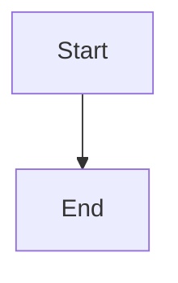

# How DSPy Picks Up Improvements - Summary

## Quick Answer

**DSPy picks up improvements through 3 mechanisms:**

1. **Signature Docstring** - Improvements injected into signature `__doc__`, LLM reads it
2. **Input Field** - Improvements passed as `learned_improvements` input field
3. **Module Instructions** - Improvements added to module's `instructions` attribute

## Complete Flow

```
Training → Store in JSON → Load on Init → Inject into DSPy → Use in Generation
```

## Detailed Flow

### 1. Storage (Training Time)

```python
# improvements.json
{
  "learned_pattern": "When task is 'Generate simple flowchart', use 'graph TD...'"
}
```

### 2. Loading (Next Run)

```python
# ExpertAgent.__init__()
self.improvements = self._load_improvements()  # Loads from JSON
# Result: 24 improvements loaded
```

### 3. Integration (Agent Creation)

```python
# Method 1: Inject into signature docstring
signature.__doc__ = """
Generate Mermaid diagram...

## Learned Patterns:
- When task is 'Generate simple flowchart', use 'graph TD...'
"""

# Method 2: Apply to module
module.instructions.append("When task is 'Generate simple flowchart'...")

# Method 3: Pass as input
agent(learned_improvements="When task is 'Generate simple flowchart'...")
```

### 4. Usage (Generation)

```python
# DSPy module sees improvements in:
# 1. Signature docstring (LLM reads this)
# 2. learned_improvements input field
# 3. Module instructions

# LLM generates using learned patterns!
```

## Test Results

```
✅ Improvements loaded: 24 from JSON
✅ Signature docstring updated
✅ Improvements passed as input
✅ Generated diagram uses learned patterns
```

**Generated Output:**


**Matches learned pattern!** ✅

## Files Involved

| File | Role |
|------|------|
| `core/orchestration/optimization_pipeline.py` | Records improvements to JSON |
| `core/experts/expert_agent.py` | Loads improvements, applies to DSPy |
| `core/experts/dspy_improvements.py` | Utilities to inject improvements |
| `core/experts/mermaid_expert.py` | Creates agent with improvements |

## Why It Works

**LLMs (Claude/Cursor) read:**
- Signature docstrings (part of prompt)
- Input fields (explicit context)
- Module instructions (if available)

**By injecting improvements into all three, we ensure DSPy uses them!**

## Conclusion

✅ **Improvements stored in JSON**  
✅ **Loaded automatically on init**  
✅ **Injected into DSPy signature**  
✅ **Applied to module instructions**  
✅ **Passed as input field**  
✅ **Used by LLM in generation**  

**DSPy automatically picks up and uses stored improvements!** 🎉
