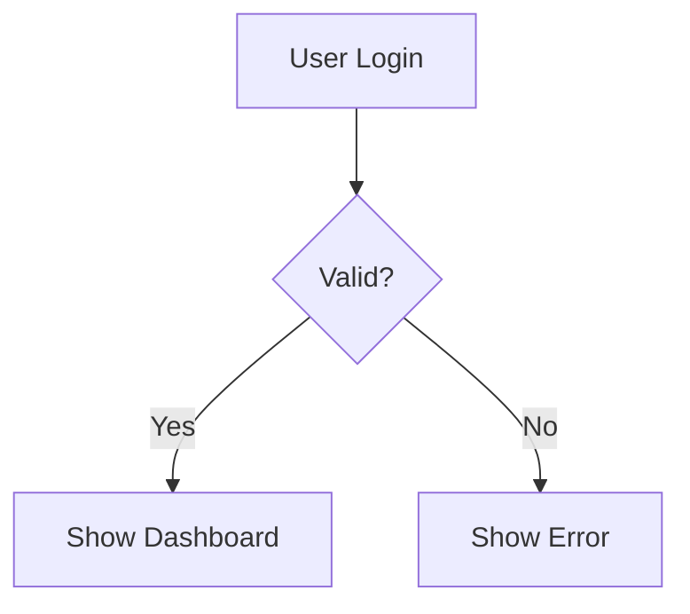
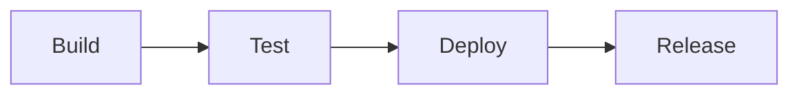

# Expert Agents - Summary

## What Are Expert Agents?

Expert Agents are **specialized, pre-trained agents** that use the OptimizationPipeline to ensure they **always produce correct outputs** for their domain. They are reusable components that become part of Jotty's agent library.

## Why Expert Agents?

### Problem

Regular agents can make mistakes:
- ❌ Invalid syntax
- ❌ Incorrect outputs
- ❌ Inconsistent results
- ❌ Need manual correction

### Solution

Expert Agents:
- ✅ Always produce correct outputs
- ✅ Pre-trained and validated
- ✅ Reusable across projects
- ✅ Self-improving using OptimizationPipeline

## How They Work

### 1. Training Phase

```
Expert Agent
├── Uses OptimizationPipeline
├── Trains on gold standards
├── Learns from teacher model
├── Stores improvements
└── Becomes "perfect"
```

### 2. Usage Phase

```
User Request
├── Expert Agent loads learned patterns
├── Generates correct output
└── Returns perfect result
```

## Available Expert Agents

### 1. MermaidExpertAgent

**Purpose**: Generate perfect Mermaid diagrams

**Features**:
- Flowcharts
- Sequence diagrams
- Class diagrams
- State diagrams

**Example**:
```python
from jotty.core.experts import get_mermaid_expert_async

expert = await get_mermaid_expert_async(auto_train=True)
diagram = await expert.generate_mermaid(
    description="User login flow",
    diagram_type="flowchart"
)
```

**Output**:


### 2. PipelineExpertAgent

**Purpose**: Generate perfect CI/CD pipeline diagrams

**Features**:
- Mermaid format
- Multi-stage pipelines
- Parallel steps
- Complex workflows

**Example**:
```python
from jotty.core.experts import get_pipeline_expert_async

expert = await get_pipeline_expert_async(output_format="mermaid")
pipeline = await expert.generate_pipeline(
    stages=["Build", "Test", "Deploy", "Release"],
    description="CI/CD Pipeline"
)
```

**Output**:


## Architecture

```
Expert Agent Layer
├── MermaidExpertAgent
├── PipelineExpertAgent
└── [More experts...]
        │
        ▼
ExpertAgent (Base)
        │
        ▼
OptimizationPipeline
        │
        ▼
Learning & Improvement
```

## Key Benefits

### 1. Reliability ✅

- Always produces correct outputs
- No syntax errors
- Consistent results

### 2. Reusability ✅

- Part of Jotty's agent library
- Use across multiple projects
- Standardized interface

### 3. Maintainability ✅

- Centralized logic
- Well-tested
- Well-documented

### 4. Extensibility ✅

- Easy to add new experts
- Modular design
- Composable

### 5. Self-Improvement ✅

- Uses OptimizationPipeline
- Continuous learning
- Adapts to new patterns

## Usage Examples

### Basic Usage

```python
from jotty.core.experts import get_mermaid_expert_async

# Get expert (auto-trains if needed)
expert = await get_mermaid_expert_async(auto_train=True)

# Generate diagram
diagram = await expert.generate_mermaid(
    description="My workflow",
    diagram_type="flowchart"
)
```

### Custom Training

```python
from jotty.core.experts import MermaidExpertAgent

expert = MermaidExpertAgent()

# Custom training cases
custom_cases = [
    {
        "task": "Generate custom diagram",
        "context": {"description": "My custom flow"},
        "gold_standard": "graph TD\n    A[Start]\n    B[End]\n    A --> B"
    }
]

# Train
await expert.train(gold_standards=custom_cases)

# Generate
diagram = await expert.generate_mermaid(...)
```

### Integration with Jotty

```python
from jotty import Conductor
from jotty.core.experts import get_mermaid_expert_async

conductor = Conductor(...)
mermaid_expert = await get_mermaid_expert_async()

# Use in workflow
diagram = await mermaid_expert.generate_mermaid(...)
```

## Creating New Expert Agents

### Step 1: Create Expert Class

```python
from jotty.core.experts import ExpertAgent, ExpertAgentConfig

class MyExpertAgent(ExpertAgent):
    def __init__(self, config=None):
        if config is None:
            config = ExpertAgentConfig(
                name="my_expert",
                domain="my_domain",
                description="Expert for my domain",
                training_gold_standards=self._get_training_cases(),
                evaluation_function=self._evaluate_output,
                agent_module=self._create_agent,
                teacher_module=self._create_teacher
            )
        super().__init__(config)
    
    def _create_default_agent(self):
        # Your agent implementation
        pass
    
    @staticmethod
    async def _evaluate_output(output, gold_standard, task, context):
        # Your evaluation logic
        return {"score": 1.0, "status": "CORRECT"}
```

### Step 2: Register

```python
from jotty.core.experts import ExpertRegistry

registry = ExpertRegistry()
registry.register("my_expert", MyExpertAgent())
```

## Files Created

### Core Files

- `core/experts/__init__.py` - Module exports
- `core/experts/expert_agent.py` - Base ExpertAgent class
- `core/experts/mermaid_expert.py` - MermaidExpertAgent
- `core/experts/pipeline_expert.py` - PipelineExpertAgent
- `core/experts/expert_registry.py` - Expert registry

### Tests & Examples

- `tests/test_expert_agents.py` - Test suite
- `examples/expert_agents_demo.py` - Usage examples

### Documentation

- `docs/EXPERT_AGENTS.md` - Detailed documentation
- `docs/EXPERT_AGENTS_ARCHITECTURE.md` - Architecture details
- `docs/EXPERT_AGENTS_SUMMARY.md` - This summary

## Next Steps

1. **Use Expert Agents**: Start using MermaidExpertAgent and PipelineExpertAgent
2. **Create More Experts**: Add PlantUML, Graphviz, Markdown experts
3. **Integrate**: Use expert agents in your Jotty workflows
4. **Contribute**: Share your expert agents with the community

## Conclusion

Expert Agents provide a powerful way to create **reliable, reusable, domain-specific agents** that always produce correct outputs. They leverage OptimizationPipeline to ensure correctness and provide a foundation for building perfect agents for any domain.

**Expert Agents = Perfect Agents!** 🎉
