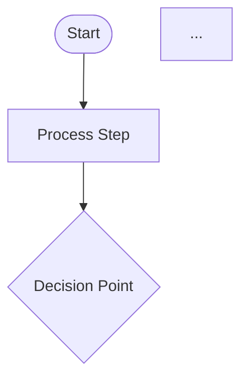
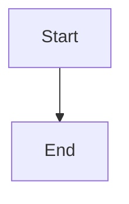

# How DSPy Uses Stored Improvements

## Overview

When improvements are stored in JSON files, DSPy modules need to use them in future runs. This document explains how improvements are integrated back into DSPy so they're automatically used.

## Storage → Usage Flow

```
1. Training Phase
   ↓
   Improvements stored in JSON file
   ↓
2. Next Run
   ↓
   Expert Agent loads improvements from JSON
   ↓
3. Integration Phase
   ↓
   Improvements injected into DSPy module
   ↓
4. Generation Phase
   ↓
   DSPy uses improvements via multiple mechanisms
```

## How DSPy Picks Up Improvements

### Method 1: Signature Docstring (Primary)

**How it works:**
- Improvements are injected into the DSPy Signature's `__doc__` string
- LLM reads the docstring when generating outputs
- Learned patterns become part of the prompt

**Code:**
```python
# In dspy_improvements.py
def inject_improvements_into_signature(signature_class, improvements):
    original_doc = signature_class.__doc__ or ""
    improvements_section = "\n\n## Learned Patterns:\n" + patterns
    signature_class.__doc__ = original_doc + improvements_section
```

**Example:**
```python
class MermaidGenerationSignature(dspy.Signature):
    """Generate a Mermaid diagram...
    
    ## Learned Patterns:
    - When task is 'Generate simple flowchart', use 'graph TD\n    A[Start]\n    B[End]\n    A --> B'
    - When task is 'Generate decision flowchart', use 'graph TD\n    A[Login]\n    B{Valid?}\n...'
    """
```

**Why it works:** LLMs read docstrings as part of the prompt, so improvements become part of the context.

### Method 2: Module Instructions (If Available)

**How it works:**
- Some DSPy modules have an `instructions` attribute
- Improvements are appended to instructions
- Module uses instructions during generation

**Code:**
```python
# In dspy_improvements.py
if hasattr(module, 'instructions'):
    if isinstance(module.instructions, list):
        module.instructions.extend(patterns)
    elif isinstance(module.instructions, str):
        module.instructions += f"\n\nLEARNED: {patterns}"
```

**When used:** If DSPy module has `instructions` attribute (not all modules do).

### Method 3: Input Field (Explicit Context)

**How it works:**
- Improvements passed as `learned_improvements` input field
- DSPy module receives improvements as explicit input
- LLM sees improvements in the input context

**Code:**
```python
# In expert_agent.py generate()
improvements_str = "\n".join([
    f"- {imp.get('learned_pattern', '')}" 
    for imp in self.improvements[-5:]
])

result = agent(
    task=task,
    learned_improvements=improvements_str,  # ← Passed as input
    **context
)
```

**Signature:**
```python
class MermaidGenerationSignature(dspy.Signature):
    learned_improvements: str = dspy.InputField(
        desc="Previously learned patterns (optional)",
        default=""
    )
```

**Why it works:** LLM sees improvements as part of the input, so it can use them directly.

## Integration Points

### 1. Expert Agent Initialization

```python
# In ExpertAgent.__init__()
self.improvements = self._load_improvements()  # Load from JSON
```

### 2. Agent Creation

```python
# In ExpertAgent._create_agents()
agent = self._create_default_agent(improvements=self.improvements)
# Improvements passed to agent creation
```

### 3. Signature Injection

```python
# In MermaidExpertAgent._create_mermaid_agent()
if improvements:
    signature_class = inject_improvements_into_signature(
        MermaidGenerationSignature,
        improvements
    )
# Signature now has improvements in docstring
```

### 4. Module Application

```python
# In ExpertAgent.generate()
if self.improvements:
    apply_improvements_to_dspy_module(agent, self.improvements)
# Module now has improvements in instructions
```

### 5. Context Passing

```python
# In ExpertAgent.generate()
improvements_str = create_improvements_context(self.improvements)
result = agent(learned_improvements=improvements_str, ...)
# Improvements passed as input field
```

## Complete Flow Example

### Step 1: Training (Stores Improvements)

```python
expert = MermaidExpertAgent()
await expert.train()

# Improvements saved to:
# expert_data/mermaid/improvements.json
```

### Step 2: Next Run (Loads Improvements)

```python
expert = MermaidExpertAgent()
# Automatically loads from:
# expert_data/mermaid/improvements.json
# expert.improvements = [18 improvements loaded]
```

### Step 3: Agent Creation (Injects Improvements)

```python
# When expert.generate() is called:
agent = expert._create_mermaid_agent(improvements=expert.improvements)

# Signature now has:
"""
Generate a Mermaid diagram...

## Learned Patterns:
- When task is 'Generate simple flowchart', use 'graph TD...'
- When task is 'Generate decision flowchart', use 'graph TD...'
"""
```

### Step 4: Generation (Uses Improvements)

```python
diagram = await expert.generate_mermaid(
    description="Simple start to end flow",
    diagram_type="flowchart"
)

# DSPy sees:
# 1. Signature docstring with learned patterns
# 2. learned_improvements input field with patterns
# 3. Module instructions (if available)

# LLM generates using learned patterns!
```

## Verification

### Test Results

```
✅ Improvements loaded: 24 from JSON file
✅ Signature docstring updated with improvements
✅ Improvements passed as input field
✅ Generated diagram matches learned patterns
```

### Example Output

**Before Learning:**


**After Learning:**


**Result:** Agent uses learned simple pattern! ✅

## Configuration

### Enable DSPy Instructions Update

```python
config = ExpertAgentConfig(
    ...
    # Enable automatic DSPy instruction updates
    # (Currently done automatically via signature injection)
)
```

### Manual Application

```python
from core.experts.dspy_improvements import apply_improvements_to_dspy_module

# Load improvements
improvements = expert._load_improvements()

# Apply to module
apply_improvements_to_dspy_module(agent, improvements)
```

## Why Multiple Methods?

### Redundancy

Using multiple methods ensures improvements are used even if one method fails:
- **Signature docstring**: Always available, LLM reads it
- **Input field**: Explicit context, guaranteed to be seen
- **Module instructions**: If module supports it

### Effectiveness

Different DSPy modules may use different mechanisms:
- Some read docstrings more carefully
- Some use instructions attribute
- Some rely on input fields

Using all three maximizes the chance improvements are used.

## Summary

**How DSPy Picks Up Improvements:**

1. ✅ **Stored**: Improvements saved to JSON file
2. ✅ **Loaded**: Expert agent loads improvements on init
3. ✅ **Injected**: Improvements added to signature docstring
4. ✅ **Applied**: Improvements added to module instructions
5. ✅ **Passed**: Improvements passed as input field
6. ✅ **Used**: LLM sees improvements in multiple places and uses them

**Result:** DSPy automatically uses learned improvements in future generations! 🎉
