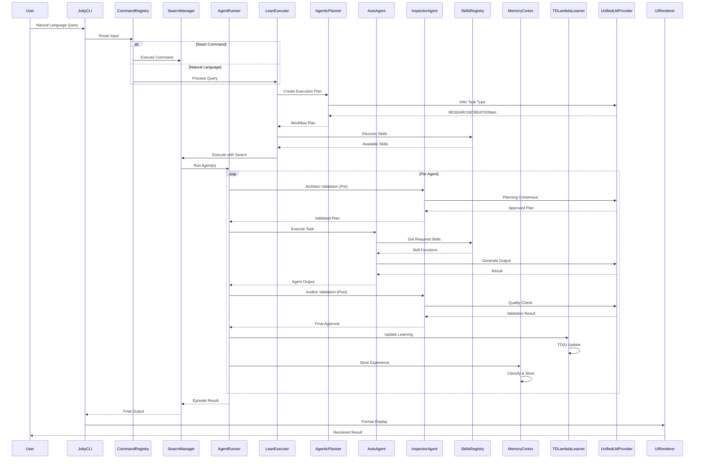
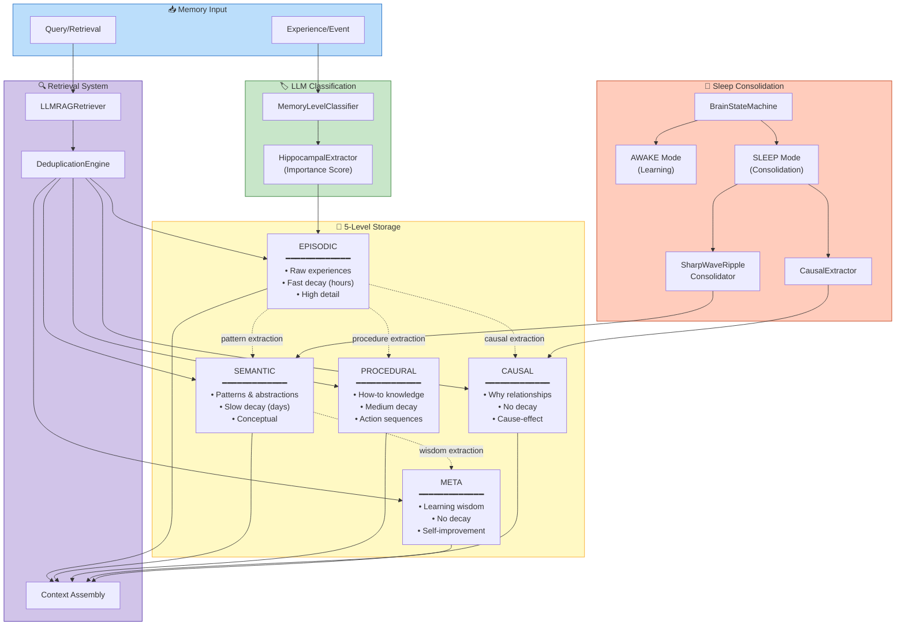
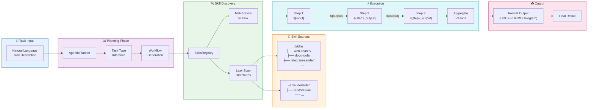
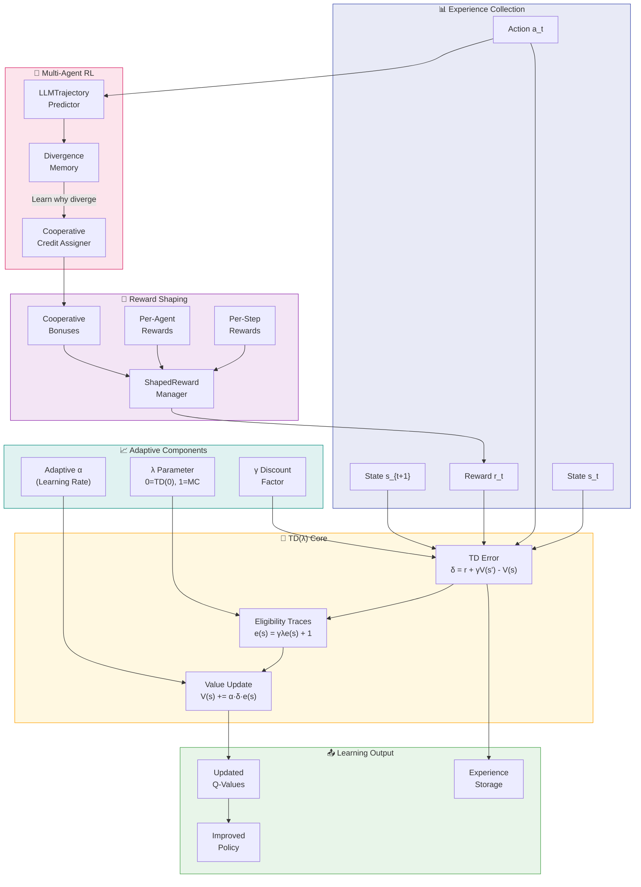
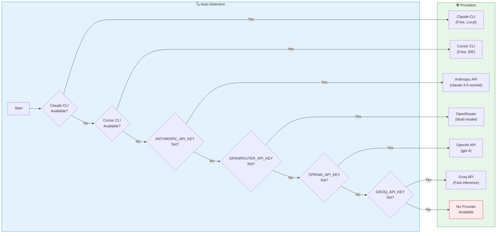
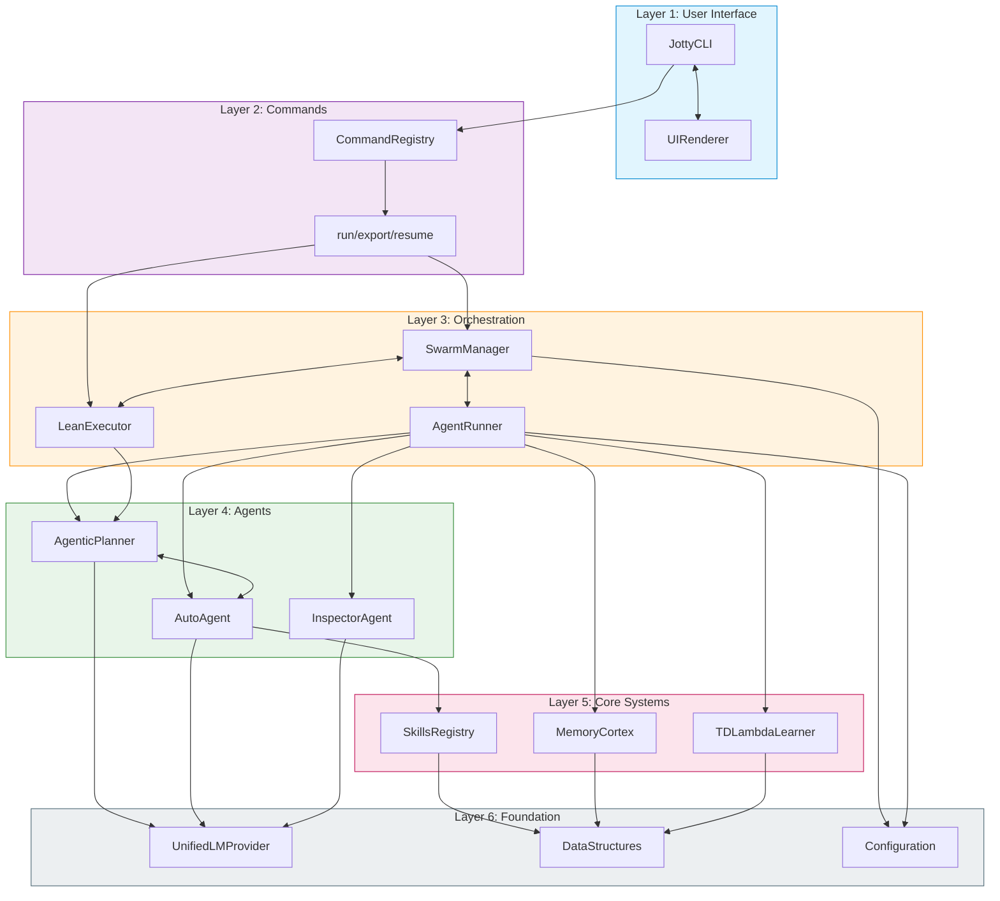

# Jotty V2 - Comprehensive Architecture Diagram

## System Overview

```mermaid
flowchart TB
    subgraph USER_LAYER["🖥️ USER INTERFACE LAYER"]
        USER[("👤 User")]
        CLI["JottyCLI<br/>cli/app.py"]
        RENDERER["UIRenderer<br/>cli/ui/renderer.py"]
    end

    subgraph COMMAND_LAYER["📋 COMMAND LAYER"]
        CMD_REGISTRY["CommandRegistry"]
        RUN_CMD["RunCommand<br/>cli/commands/run.py"]
        EXPORT_CMD["ExportCommand<br/>cli/commands/export.py"]
        RESUME_CMD["ResumeCommand<br/>cli/commands/resume.py"]
        JUSTJOT_CMD["JustJotCommand<br/>cli/commands/justjot.py"]
    end

    subgraph ORCHESTRATION_LAYER["🎼 ORCHESTRATION LAYER (V2)"]
        SWARM_MGR["SwarmManager<br/>core/orchestration/v2/swarm_manager.py"]
        AGENT_RUNNER["AgentRunner<br/>core/orchestration/v2/agent_runner.py"]
        LEAN_EXEC["LeanExecutor<br/>core/orchestration/v2/lean_executor.py"]
        SWARM_INSTALL["SwarmInstaller<br/>core/orchestration/v2/swarm_installer.py"]

        subgraph TEMPLATES["📄 Swarm Templates"]
            TEMPLATE_REG["TemplateRegistry"]
            SWARM_LEAN["SwarmLean"]
            BASE_TEMPLATE["BaseTemplate"]
        end
    end

    subgraph AGENT_LAYER["🤖 AGENT LAYER"]
        AGENTIC_PLANNER["AgenticPlanner<br/>core/agents/agentic_planner.py"]
        AUTO_AGENT["AutoAgent<br/>core/agents/auto_agent.py"]
        INSPECTOR["InspectorAgent<br/>(Architect/Auditor)"]

        subgraph PLANNING["📊 Planning"]
            TASK_INFERENCE["Task Type Inference<br/>RESEARCH|COMPARISON|<br/>CREATION|ANALYSIS|<br/>COMMUNICATION|AUTOMATION"]
            WORKFLOW_PLAN["Workflow Planning<br/>Steps + Dependencies"]
        end
    end

    subgraph MEMORY_LAYER["🧠 MEMORY SYSTEM (Brain-Inspired)"]
        CORTEX["MemoryCortex<br/>core/memory/cortex.py"]

        subgraph MEMORY_LEVELS["📚 5-Level Hierarchy"]
            EPISODIC["EPISODIC<br/>(fast decay)"]
            SEMANTIC["SEMANTIC<br/>(slow decay)"]
            PROCEDURAL["PROCEDURAL<br/>(medium decay)"]
            META["META<br/>(no decay)"]
            CAUSAL["CAUSAL<br/>(no decay)"]
        end

        subgraph MEMORY_COMPONENTS["🔧 Memory Components"]
            LEVEL_CLASSIFIER["MemoryLevelClassifier<br/>(LLM-based)"]
            RAG_RETRIEVER["LLMRAGRetriever"]
            DEDUP_ENGINE["DeduplicationEngine"]
            CAUSAL_EXTRACT["CausalExtractor"]
            BRAIN_STATE["BrainStateMachine<br/>AWAKE|SLEEP"]
            HIPPO_EXTRACT["HippocampalExtractor"]
            RIPPLE_CONSOL["SharpWaveRipple<br/>Consolidator"]
        end
    end

    subgraph LEARNING_LAYER["📈 LEARNING SYSTEM (RL)"]
        TD_LEARNER["TDLambdaLearner<br/>Temporal Difference"]

        subgraph RL_COMPONENTS["🎓 RL Components"]
            TRAJECTORY_PRED["LLMTrajectoryPredictor"]
            DIVERGENCE_MEM["DivergenceMemory"]
            CREDIT_ASSIGN["CooperativeCreditAssigner"]
            SHAPED_REWARD["ShapedRewardManager"]
        end

        ADAPTIVE_RATE["Adaptive Learning Rate"]
        ELIGIBILITY["Eligibility Traces (λ)"]
    end

    subgraph SKILLS_LAYER["⚡ SKILLS SYSTEM"]
        SKILLS_REG["SkillsRegistry<br/>core/registry/skills_registry.py"]

        subgraph SKILL_DIRS["📁 Skill Sources"]
            REPO_SKILLS["/skills/"]
            CLAUDE_SKILLS["~/.claude/skills/"]
        end

        subgraph SKILL_STRUCT["📦 Skill Structure"]
            SKILL_MD["SKILL.md<br/>(metadata)"]
            TOOLS_PY["tools.py<br/>(callables)"]
        end

        subgraph SKILL_CATEGORIES["🏷️ Skill Categories"]
            INPUT_SKILLS["INPUT<br/>web-search, file-read"]
            OUTPUT_SKILLS["OUTPUT<br/>docx-tools, telegram"]
            TRANSFORM_SKILLS["TRANSFORM<br/>document-converter"]
        end
    end

    subgraph PROVIDER_LAYER["🔌 LLM PROVIDER SYSTEM"]
        UNIFIED_PROVIDER["UnifiedLMProvider<br/>core/foundation/unified_lm_provider.py"]

        subgraph PROVIDERS["🌐 Supported Providers"]
            ANTHROPIC["Anthropic"]
            OPENAI["OpenAI"]
            GOOGLE["Google"]
            GROQ["Groq"]
            OPENROUTER["OpenRouter"]
            CLAUDE_CLI["Claude CLI"]
            CURSOR_CLI["Cursor CLI"]
        end

        AUTO_DETECT["Auto-Detection<br/>Priority Chain"]
    end

    subgraph CONFIG_LAYER["⚙️ CONFIGURATION SYSTEM"]
        CLI_CONFIG["CLIConfig<br/>cli/config/schema.py"]
        JOTTY_CONFIG["JottyConfig<br/>(21 categories)"]
        AGENT_CONFIG["AgentConfig"]

        subgraph CONFIG_CATS["📋 Config Categories"]
            PERSIST_CFG["Persistence"]
            EXEC_CFG["Execution"]
            MEMORY_CFG["Memory"]
            LEARNING_CFG["Learning"]
            VALIDATION_CFG["Validation"]
        end
    end

    subgraph DATA_LAYER["📊 DATA STRUCTURES"]
        DATA_STRUCTS["core/foundation/data_structures.py"]
        EPISODE_RESULT["EpisodeResult"]
        AGENT_STATE["AgentState"]
        SWARM_STATE["SwarmState"]
        TASK_BOARD["SwarmTaskBoard"]
    end

    %% User interactions
    USER --> CLI
    CLI --> RENDERER
    RENDERER --> USER

    %% CLI to Commands
    CLI --> CMD_REGISTRY
    CMD_REGISTRY --> RUN_CMD
    CMD_REGISTRY --> EXPORT_CMD
    CMD_REGISTRY --> RESUME_CMD
    CMD_REGISTRY --> JUSTJOT_CMD

    %% Commands to Orchestration
    RUN_CMD --> SWARM_MGR
    JUSTJOT_CMD --> LEAN_EXEC

    %% Orchestration internal
    SWARM_MGR --> AGENT_RUNNER
    SWARM_MGR --> LEAN_EXEC
    SWARM_MGR --> SWARM_INSTALL
    SWARM_INSTALL --> TEMPLATE_REG
    TEMPLATE_REG --> SWARM_LEAN
    TEMPLATE_REG --> BASE_TEMPLATE

    %% Orchestration to Agents
    AGENT_RUNNER --> AUTO_AGENT
    AGENT_RUNNER --> INSPECTOR
    LEAN_EXEC --> AGENTIC_PLANNER

    %% Agent internal
    AUTO_AGENT --> AGENTIC_PLANNER
    AGENTIC_PLANNER --> TASK_INFERENCE
    AGENTIC_PLANNER --> WORKFLOW_PLAN

    %% Agents to Skills
    AUTO_AGENT --> SKILLS_REG
    LEAN_EXEC --> SKILLS_REG
    SKILLS_REG --> REPO_SKILLS
    SKILLS_REG --> CLAUDE_SKILLS
    REPO_SKILLS --> SKILL_MD
    REPO_SKILLS --> TOOLS_PY

    %% Memory connections
    SWARM_MGR --> CORTEX
    AGENT_RUNNER --> CORTEX
    CORTEX --> EPISODIC
    CORTEX --> SEMANTIC
    CORTEX --> PROCEDURAL
    CORTEX --> META
    CORTEX --> CAUSAL
    CORTEX --> LEVEL_CLASSIFIER
    CORTEX --> RAG_RETRIEVER
    CORTEX --> DEDUP_ENGINE
    CORTEX --> BRAIN_STATE
    BRAIN_STATE --> HIPPO_EXTRACT
    BRAIN_STATE --> RIPPLE_CONSOL
    CORTEX --> CAUSAL_EXTRACT

    %% Learning connections
    AGENT_RUNNER --> TD_LEARNER
    TD_LEARNER --> TRAJECTORY_PRED
    TD_LEARNER --> DIVERGENCE_MEM
    TD_LEARNER --> CREDIT_ASSIGN
    TD_LEARNER --> SHAPED_REWARD
    TD_LEARNER --> ADAPTIVE_RATE
    TD_LEARNER --> ELIGIBILITY

    %% Provider connections
    SWARM_MGR --> UNIFIED_PROVIDER
    AGENTIC_PLANNER --> UNIFIED_PROVIDER
    AUTO_AGENT --> UNIFIED_PROVIDER
    LEAN_EXEC --> UNIFIED_PROVIDER
    UNIFIED_PROVIDER --> ANTHROPIC
    UNIFIED_PROVIDER --> OPENAI
    UNIFIED_PROVIDER --> GOOGLE
    UNIFIED_PROVIDER --> GROQ
    UNIFIED_PROVIDER --> OPENROUTER
    UNIFIED_PROVIDER --> CLAUDE_CLI
    UNIFIED_PROVIDER --> CURSOR_CLI
    UNIFIED_PROVIDER --> AUTO_DETECT

    %% Config connections
    CLI --> CLI_CONFIG
    SWARM_MGR --> JOTTY_CONFIG
    AGENT_RUNNER --> AGENT_CONFIG
    CLI_CONFIG --> PERSIST_CFG
    CLI_CONFIG --> EXEC_CFG
    JOTTY_CONFIG --> MEMORY_CFG
    JOTTY_CONFIG --> LEARNING_CFG
    JOTTY_CONFIG --> VALIDATION_CFG

    %% Data structure connections
    SWARM_MGR --> EPISODE_RESULT
    AGENT_RUNNER --> AGENT_STATE
    SWARM_MGR --> SWARM_STATE
    SWARM_MGR --> TASK_BOARD

    classDef userLayer fill:#e1f5fe,stroke:#01579b
    classDef cmdLayer fill:#f3e5f5,stroke:#4a148c
    classDef orchLayer fill:#fff3e0,stroke:#e65100
    classDef agentLayer fill:#e8f5e9,stroke:#1b5e20
    classDef memLayer fill:#fce4ec,stroke:#880e4f
    classDef learnLayer fill:#f1f8e9,stroke:#33691e
    classDef skillLayer fill:#e0f2f1,stroke:#004d40
    classDef providerLayer fill:#e8eaf6,stroke:#1a237e
    classDef configLayer fill:#fff8e1,stroke:#ff6f00
    classDef dataLayer fill:#eceff1,stroke:#37474f

    class USER_LAYER userLayer
    class COMMAND_LAYER cmdLayer
    class ORCHESTRATION_LAYER orchLayer
    class AGENT_LAYER agentLayer
    class MEMORY_LAYER memLayer
    class LEARNING_LAYER learnLayer
    class SKILLS_LAYER skillLayer
    class PROVIDER_LAYER providerLayer
    class CONFIG_LAYER configLayer
    class DATA_LAYER dataLayer
```



---

## Execution Flow Diagram



---

## Memory System Deep Dive



---

## Skills Execution Flow



---

## Learning System (TD-Lambda with A-Team)



---

## Provider Auto-Detection Chain



---

## Complete Component Interaction Matrix



---

## File Structure Reference

```
Jotty/
├── cli/
│   ├── app.py                    # JottyCLI - Main entry point
│   ├── ui/
│   │   └── renderer.py           # UIRenderer - Display formatting
│   ├── commands/
│   │   ├── __init__.py          # CommandRegistry
│   │   ├── run.py               # RunCommand
│   │   ├── export.py            # ExportCommand
│   │   ├── resume.py            # ResumeCommand
│   │   └── justjot.py           # JustJotCommand
│   └── config/
│       └── schema.py            # CLIConfig
│
├── core/
│   ├── orchestration/
│   │   └── v2/
│   │       ├── swarm_manager.py  # SwarmManager - Central orchestrator
│   │       ├── agent_runner.py   # AgentRunner - Per-agent execution
│   │       ├── lean_executor.py  # LeanExecutor - LLM-first execution
│   │       ├── swarm_installer.py # SwarmInstaller
│   │       └── templates/
│   │           ├── __init__.py   # TemplateRegistry
│   │           ├── registry.py   # Template registration
│   │           └── swarm_lean.py # SwarmLean template
│   │
│   ├── agents/
│   │   ├── agentic_planner.py   # AgenticPlanner - LLM-based planning
│   │   └── auto_agent.py        # AutoAgent - Autonomous execution
│   │
│   ├── memory/
│   │   └── cortex.py            # MemoryCortex - Brain-inspired memory
│   │
│   ├── registry/
│   │   └── skills_registry.py   # SkillsRegistry - Skill management
│   │
│   └── foundation/
│       ├── data_structures.py   # Core types & dataclasses
│       └── unified_lm_provider.py # LLM provider abstraction
│
└── skills/
    ├── web-search/              # Web search skill
    ├── docx-tools/              # Document generation
    ├── telegram-sender/         # Telegram integration
    ├── financial-visualization/ # Charts & graphs
    └── ...                      # 25+ more skills
```

---

## Design Patterns Used

| Pattern | Component | Purpose |
|---------|-----------|---------|
| **Registry** | SkillsRegistry, TemplateRegistry, CommandRegistry | Central lookup for components |
| **Strategy** | Validators, Memory Classifiers | Interchangeable algorithms |
| **Adapter** | UnifiedLMProvider | Abstract different LLM APIs |
| **Factory** | LM Provider creation | Create appropriate provider |
| **Observer** | Status callbacks | Progress notifications |
| **Lazy Init** | Skills, SwarmManager components | Defer expensive initialization |
| **Chain of Responsibility** | Command execution | Handle commands in sequence |
| **Composite** | Multi-level memory | Tree structure for memories |
| **State** | BrainStateMachine | Manage AWAKE/SLEEP transitions |
| **Template Method** | BaseTemplate, SwarmLean | Define algorithm skeleton |

---

## Key Architectural Principles

1. **LLM-First Design**: All decisions via LLM, no hardcoded rules
2. **Zero-Configuration Intelligence**: Natural language → automatic agent creation
3. **Brain-Inspired Memory**: 5-level hierarchy with consolidation
4. **Temporal-Difference Learning**: TD(λ) with adaptive rates
5. **Skill-Based Autonomy**: Modular, discoverable capabilities
6. **Lazy Initialization**: Fast startup, load on demand
7. **Multi-Provider Abstraction**: Unified interface, auto-detection
8. **Separation of Concerns**: Clear layer boundaries
