# Jotty V2 - Comprehensive Architecture Diagram

## System Overview


---

## Execution Flow Diagram


---

## Memory System Deep Dive

```mermaid
flowchart TB
    subgraph INPUT["📥 Memory Input"]
        EXP["Experience/Event"]
        QUERY["Query/Retrieval"]
    end

    subgraph CLASSIFICATION["🏷️ LLM Classification"]
        CLASSIFIER["MemoryLevelClassifier"]
        SALIENCE["HippocampalExtractor<br/>(Importance Score)"]
    end

    subgraph STORAGE["💾 5-Level Storage"]
        direction TB
        L1["EPISODIC<br/>━━━━━━━━━━━━━<br/>• Raw experiences<br/>• Fast decay (hours)<br/>• High detail"]
        L2["SEMANTIC<br/>━━━━━━━━━━━━━<br/>• Patterns & abstractions<br/>• Slow decay (days)<br/>• Conceptual"]
        L3["PROCEDURAL<br/>━━━━━━━━━━━━━<br/>• How-to knowledge<br/>• Medium decay<br/>• Action sequences"]
        L4["META<br/>━━━━━━━━━━━━━<br/>• Learning wisdom<br/>• No decay<br/>• Self-improvement"]
        L5["CAUSAL<br/>━━━━━━━━━━━━━<br/>• Why relationships<br/>• No decay<br/>• Cause-effect"]
    end

    subgraph RETRIEVAL["🔍 Retrieval System"]
        RAG["LLMRAGRetriever"]
        DEDUP["DeduplicationEngine"]
        CONTEXT["Context Assembly"]
    end

    subgraph CONSOLIDATION["🌙 Sleep Consolidation"]
        BSM["BrainStateMachine"]
        AWAKE["AWAKE Mode<br/>(Learning)"]
        SLEEP["SLEEP Mode<br/>(Consolidation)"]
        SWR["SharpWaveRipple<br/>Consolidator"]
        CAUSAL_EX["CausalExtractor"]
    end

    EXP --> CLASSIFIER
    CLASSIFIER --> SALIENCE
    SALIENCE --> L1
    L1 -.->|pattern extraction| L2
    L1 -.->|procedure extraction| L3
    L2 -.->|wisdom extraction| L4
    L1 -.->|causal extraction| L5

    QUERY --> RAG
    RAG --> DEDUP
    DEDUP --> L1
    DEDUP --> L2
    DEDUP --> L3
    DEDUP --> L4
    DEDUP --> L5
    L1 --> CONTEXT
    L2 --> CONTEXT
    L3 --> CONTEXT
    L4 --> CONTEXT
    L5 --> CONTEXT

    BSM --> AWAKE
    BSM --> SLEEP
    SLEEP --> SWR
    SWR --> L2
    SLEEP --> CAUSAL_EX
    CAUSAL_EX --> L5

    classDef input fill:#bbdefb,stroke:#1565c0
    classDef classify fill:#c8e6c9,stroke:#2e7d32
    classDef storage fill:#fff9c4,stroke:#f9a825
    classDef retrieve fill:#d1c4e9,stroke:#512da8
    classDef consolidate fill:#ffccbc,stroke:#bf360c

    class INPUT input
    class CLASSIFICATION classify
    class STORAGE storage
    class RETRIEVAL retrieve
    class CONSOLIDATION consolidate
```



---

## Skills Execution Flow

```mermaid
flowchart LR
    subgraph TASK["📝 Task Input"]
        NL["Natural Language<br/>Task Description"]
    end

    subgraph PLANNING["📊 Planning Phase"]
        AP["AgenticPlanner"]
        INFER["Task Type<br/>Inference"]
        WORKFLOW["Workflow<br/>Generation"]
    end

    subgraph DISCOVERY["🔍 Skill Discovery"]
        SR["SkillsRegistry"]
        SCAN["Lazy Scan<br/>Directories"]
        MATCH["Match Skills<br/>to Task"]
    end

    subgraph SKILL_SOURCES["📁 Skill Sources"]
        DIR1["/skills/<br/>├── web-search/<br/>├── docx-tools/<br/>├── telegram-sender/<br/>└── ..."]
        DIR2["~/.claude/skills/<br/>├── custom-skill/<br/>└── ..."]
    end

    subgraph EXECUTION["⚡ Execution"]
        STEP1["Step 1<br/>${input}"]
        STEP2["Step 2<br/>${step1_output}"]
        STEP3["Step 3<br/>${step2_output}"]
        AGG["Aggregate<br/>Results"]
    end

    subgraph OUTPUT["📤 Output"]
        FORMAT["Format Output<br/>(DOCX/PDF/MD/Telegram)"]
        RESULT["Final Result"]
    end

    NL --> AP
    AP --> INFER
    INFER --> WORKFLOW
    WORKFLOW --> SR
    SR --> SCAN
    SCAN --> DIR1
    SCAN --> DIR2
    SR --> MATCH
    MATCH --> STEP1
    STEP1 -->|"${output}"| STEP2
    STEP2 -->|"${output}"| STEP3
    STEP3 --> AGG
    AGG --> FORMAT
    FORMAT --> RESULT

    classDef task fill:#e3f2fd,stroke:#1565c0
    classDef plan fill:#f3e5f5,stroke:#7b1fa2
    classDef discover fill:#e8f5e9,stroke:#388e3c
    classDef source fill:#fff3e0,stroke:#ef6c00
    classDef exec fill:#e0f7fa,stroke:#00838f
    classDef output fill:#fce4ec,stroke:#c2185b

    class TASK task
    class PLANNING plan
    class DISCOVERY discover
    class SKILL_SOURCES source
    class EXECUTION exec
    class OUTPUT output
```



---

## Learning System (TD-Lambda with A-Team)

```mermaid
flowchart TB
    subgraph EXPERIENCE["📊 Experience Collection"]
        STATE["State s_t"]
        ACTION["Action a_t"]
        REWARD["Reward r_t"]
        NEXT_STATE["State s_{t+1}"]
    end

    subgraph TD_CORE["🎯 TD(λ) Core"]
        TD_ERROR["TD Error<br/>δ = r + γV(s') - V(s)"]
        ELIG["Eligibility Traces<br/>e(s) = γλe(s) + 1"]
        VALUE_UPDATE["Value Update<br/>V(s) += α·δ·e(s)"]
    end

    subgraph ADAPTIVE["📈 Adaptive Components"]
        ALPHA["Adaptive α<br/>(Learning Rate)"]
        LAMBDA["λ Parameter<br/>0=TD(0), 1=MC"]
        GAMMA["γ Discount<br/>Factor"]
    end

    subgraph MARL["🤝 Multi-Agent RL"]
        PRED["LLMTrajectory<br/>Predictor"]
        DIV_MEM["Divergence<br/>Memory"]
        CREDIT["Cooperative<br/>Credit Assigner"]
    end

    subgraph SHAPING["🎁 Reward Shaping"]
        PER_STEP["Per-Step<br/>Rewards"]
        PER_AGENT["Per-Agent<br/>Rewards"]
        COOP["Cooperative<br/>Bonuses"]
        SHAPED["ShapedReward<br/>Manager"]
    end

    subgraph OUTPUT["📤 Learning Output"]
        Q_VALUES["Updated<br/>Q-Values"]
        POLICY["Improved<br/>Policy"]
        MEMORY["Experience<br/>Storage"]
    end

    STATE --> TD_ERROR
    ACTION --> TD_ERROR
    REWARD --> TD_ERROR
    NEXT_STATE --> TD_ERROR

    TD_ERROR --> ELIG
    ELIG --> VALUE_UPDATE

    ALPHA --> VALUE_UPDATE
    LAMBDA --> ELIG
    GAMMA --> TD_ERROR

    ACTION --> PRED
    PRED --> DIV_MEM
    DIV_MEM -->|"Learn why diverge"| CREDIT
    CREDIT --> COOP

    PER_STEP --> SHAPED
    PER_AGENT --> SHAPED
    COOP --> SHAPED
    SHAPED --> REWARD

    VALUE_UPDATE --> Q_VALUES
    Q_VALUES --> POLICY
    TD_ERROR --> MEMORY

    classDef exp fill:#e8eaf6,stroke:#3949ab
    classDef core fill:#fff8e1,stroke:#ffa000
    classDef adaptive fill:#e0f2f1,stroke:#00897b
    classDef marl fill:#fce4ec,stroke:#d81b60
    classDef shape fill:#f3e5f5,stroke:#8e24aa
    classDef output fill:#e8f5e9,stroke:#43a047

    class EXPERIENCE exp
    class TD_CORE core
    class ADAPTIVE adaptive
    class MARL marl
    class SHAPING shape
    class OUTPUT output
```



---

## Provider Auto-Detection Chain


---

## Complete Component Interaction Matrix


---

## File Structure Reference

```
Jotty/
├── cli/
│   ├── app.py                    # JottyCLI - Main entry point
│   ├── ui/
│   │   └── renderer.py           # UIRenderer - Display formatting
│   ├── commands/
│   │   ├── __init__.py          # CommandRegistry
│   │   ├── run.py               # RunCommand
│   │   ├── export.py            # ExportCommand
│   │   ├── resume.py            # ResumeCommand
│   │   └── justjot.py           # JustJotCommand
│   └── config/
│       └── schema.py            # CLIConfig
│
├── core/
│   ├── orchestration/
│   │   └── v2/
│   │       ├── swarm_manager.py  # SwarmManager - Central orchestrator
│   │       ├── agent_runner.py   # AgentRunner - Per-agent execution
│   │       ├── lean_executor.py  # LeanExecutor - LLM-first execution
│   │       ├── swarm_installer.py # SwarmInstaller
│   │       └── templates/
│   │           ├── __init__.py   # TemplateRegistry
│   │           ├── registry.py   # Template registration
│   │           └── swarm_lean.py # SwarmLean template
│   │
│   ├── agents/
│   │   ├── agentic_planner.py   # AgenticPlanner - LLM-based planning
│   │   └── auto_agent.py        # AutoAgent - Autonomous execution
│   │
│   ├── memory/
│   │   └── cortex.py            # MemoryCortex - Brain-inspired memory
│   │
│   ├── registry/
│   │   └── skills_registry.py   # SkillsRegistry - Skill management
│   │
│   └── foundation/
│       ├── data_structures.py   # Core types & dataclasses
│       └── unified_lm_provider.py # LLM provider abstraction
│
└── skills/
    ├── web-search/              # Web search skill
    ├── docx-tools/              # Document generation
    ├── telegram-sender/         # Telegram integration
    ├── financial-visualization/ # Charts & graphs
    └── ...                      # 25+ more skills
```

---

## Design Patterns Used

| Pattern | Component | Purpose |
|---------|-----------|---------|
| **Registry** | SkillsRegistry, TemplateRegistry, CommandRegistry | Central lookup for components |
| **Strategy** | Validators, Memory Classifiers | Interchangeable algorithms |
| **Adapter** | UnifiedLMProvider | Abstract different LLM APIs |
| **Factory** | LM Provider creation | Create appropriate provider |
| **Observer** | Status callbacks | Progress notifications |
| **Lazy Init** | Skills, SwarmManager components | Defer expensive initialization |
| **Chain of Responsibility** | Command execution | Handle commands in sequence |
| **Composite** | Multi-level memory | Tree structure for memories |
| **State** | BrainStateMachine | Manage AWAKE/SLEEP transitions |
| **Template Method** | BaseTemplate, SwarmLean | Define algorithm skeleton |

---

## Key Architectural Principles

1. **LLM-First Design**: All decisions via LLM, no hardcoded rules
2. **Zero-Configuration Intelligence**: Natural language → automatic agent creation
3. **Brain-Inspired Memory**: 5-level hierarchy with consolidation
4. **Temporal-Difference Learning**: TD(λ) with adaptive rates
5. **Skill-Based Autonomy**: Modular, discoverable capabilities
6. **Lazy Initialization**: Fast startup, load on demand
7. **Multi-Provider Abstraction**: Unified interface, auto-detection
8. **Separation of Concerns**: Clear layer boundaries
