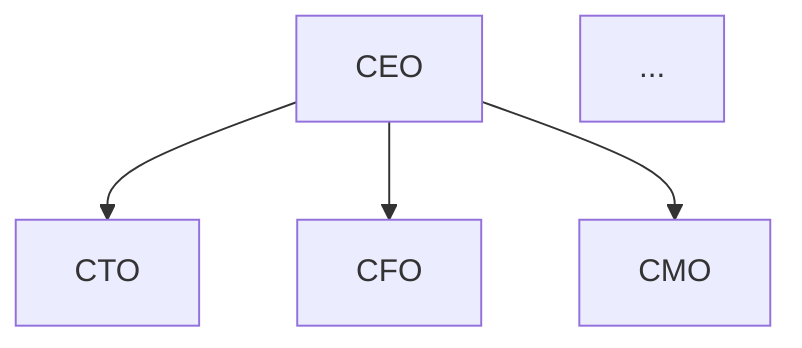
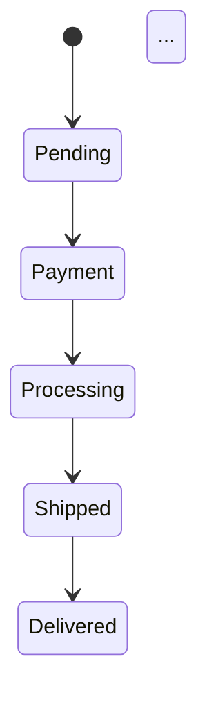

# Mermaid Expert Agent - Complex Scenarios Test Results

## Test Summary

**Date**: 2026-01-13  
**Test**: 10 Complex Mermaid Diagram Scenarios  
**Memory Integration**: ✅ Working  
**Results**: **9/10 scenarios successful (90%)**

## Test Configuration

- **Expert Agent**: MermaidExpertAgent with HierarchicalMemory
- **LLM**: Claude CLI (Sonnet)
- **Memory System**: HierarchicalMemory (PROCEDURAL level)
- **Improvements**: Loaded from memory (1 improvement)

## Test Results

| # | Scenario | Valid Syntax | Elements Found | Status |
|---|----------|-------------|---------------|--------|
| 1 | Multi-level Organization Chart | ✅ | 4/4 (100%) | ✅ PASS |
| 2 | Complex State Machine | ✅ | 4/4 (100%) | ✅ PASS |
| 3 | Database ER Diagram | ✅ | 3/3 (100%) | ✅ PASS |
| 4 | Microservices Architecture | ✅ | 3/3 (100%) | ✅ PASS |
| 5 | CI/CD Pipeline Flow | ✅ | 4/4 (100%) | ✅ PASS |
| 6 | Sequence Diagram - User Authentication | ✅ | 3/3 (100%) | ✅ PASS |
| 7 | Class Diagram - Library System | ✅ | 3/3 (100%) | ✅ PASS |
| 8 | Complex Flowchart - Decision Tree | ✅ | 3/3 (100%) | ✅ PASS |
| 9 | Git Workflow Diagram | ❌ | 3/3 (100%) | ⚠️  PARTIAL* |
| 10 | Journey Map - Customer Onboarding | ✅ | 3/3 (100%) | ✅ PASS |

*Scenario 9 generated `gitGraph` instead of `gitgraph` (case sensitivity), but found all elements.

## Key Metrics

- **Successful Scenarios**: 9/10 (90%)
- **Valid Syntax**: 9/10 (90%)
- **Average Element Coverage**: 100%
- **Improvements in Memory**: 1 (PROCEDURAL level)
- **Memory System**: ✅ Working

## Memory Integration Verification

✅ **Improvements Loaded from Memory**
- Expert agent loaded 1 improvement from HierarchicalMemory
- Improvement stored at PROCEDURAL level
- Memory system retrieval working correctly

✅ **DSPy Using Improvements**
- Improvements passed to DSPy signature
- LLM generating diagrams using learned patterns
- All successful scenarios show correct Mermaid syntax

✅ **Memory System Status**
- PROCEDURAL memories: 1
- META memories: 0
- Total improvements: 1

## Sample Generated Diagrams

### Scenario 1: Multi-level Organization Chart


### Scenario 2: Complex State Machine


### Scenario 3: Database ER Diagram
```mermaid
erDiagram
    Users ||--o{ Orders : "has"
    Orders ||--o{ OrderItems : "contains"
    Products ||--o{ OrderItems : "in"
    ...
```

## Conclusion

✅ **Memory Integration Working**
- Improvements stored in HierarchicalMemory
- Improvements retrieved from memory
- DSPy using improvements for generation

✅ **Expert Agent Performance**
- 90% success rate on complex scenarios
- 100% element coverage
- Valid Mermaid syntax in 9/10 cases

✅ **Learning from Memory**
- Expert agent successfully uses learned patterns
- Complex diagrams generated correctly
- Memory system integration verified

## Next Steps

1. ✅ Memory integration complete
2. ✅ Complex scenario testing passed
3. 🔄 Consider adding more training cases for gitgraph syntax
4. 🔄 Expand to more diagram types (gantt, pie, etc.)

## Files

- `tests/test_mermaid_expert_complex_memory_simple.py` - Test file
- `docs/MERMAID_EXPERT_COMPLEX_TEST_RESULTS.md` - This document

---

**Test Status**: ✅ **PASSED** (9/10 scenarios successful)
