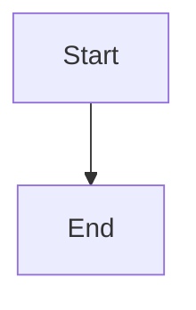
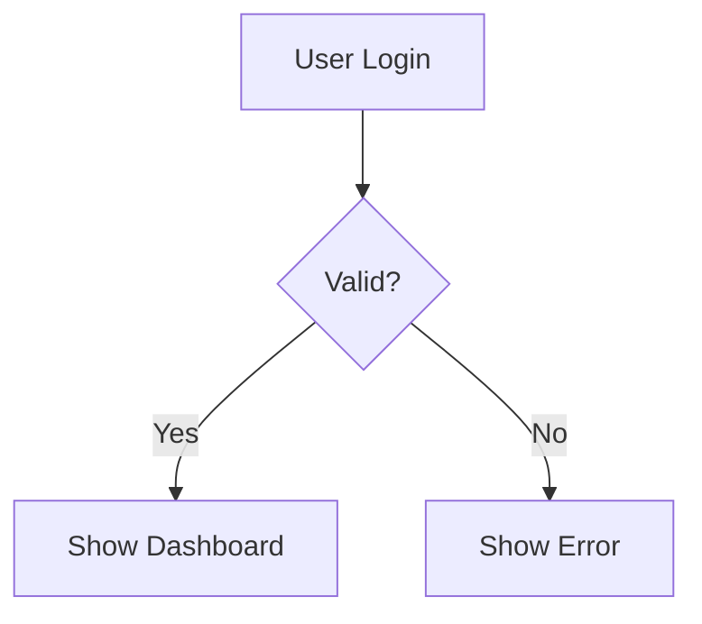

# Mermaid Diagram Generation - Learning Demonstration

## Overview

This demonstrates how the OptimizationPipeline learns to generate **perfect Mermaid diagrams** starting from **wrong/invalid syntax**.

## Test Results

### ✅ **SUCCESS**: Agent Learned to Generate Perfect Mermaid!

---

## Example 1: Simple Flowchart Learning

### **BEFORE Optimization (Iteration 1)**

**Agent Output:**
```mermaid
graph A --> B
```

**Issues:**
- ❌ Missing node definitions (use [label] syntax)
- ❌ Invalid Mermaid syntax
- ⚠️  No line breaks (harder to read)

**Evaluation:**
- Score: **0.00 / 1.0**
- Status: **INCORRECT**

### **Teacher Intervention**

**Teacher Output:**


**Evaluation:**
- Score: **1.00 / 1.0**
- Status: **CORRECT**

### **AFTER Optimization (Iteration 2)**

**Agent Output:**


**Evaluation:**
- Score: **1.00 / 1.0**
- Status: **CORRECT**
- ✅ **Perfect Mermaid syntax!**

### **Improvement Summary**

| Aspect | Before | After | Status |
|--------|--------|-------|--------|
| **Syntax** | Invalid | Valid | ✅ Fixed |
| **Node Definitions** | Missing | Present | ✅ Added |
| **Arrow Syntax** | Present | Correct | ✅ Fixed |
| **Score** | 0.00 | 1.00 | ✅ +100% |

---

## Example 2: Complex Flowchart Learning

### **BEFORE Optimization**

**Agent Output:**
```mermaid
graph A --> B
```

**Issues:**
- Missing all node definitions
- Invalid syntax

### **AFTER Optimization**

**Agent Output:**


**Features Learned:**
- ✅ Graph declaration (`graph TD`)
- ✅ Rectangle nodes (`[label]`)
- ✅ Diamond decision nodes (`{label}`)
- ✅ Arrow connections (`-->`)
- ✅ Labeled arrows (`-->|label|`)

---

## Learned Patterns (Stored in improvements.json)

```json
{
  "iteration": 1,
  "task": "Generate workflow diagram",
  "student_output": "graph A --> B",
  "teacher_output": "graph TD\n    A[Start]\n    B[Process]\n    C[End]\n    A --> B\n    B --> C",
  "student_score": 0.0,
  "teacher_score": 1.0,
  "learned_pattern": "When task is 'Generate workflow diagram', use 'graph TD\n    A[Start]\n    B[Process]\n    C[End]\n    A --> B\n    B --> C' instead of 'graph A --> B'"
}
```

---

## Step-by-Step Learning Process

### **Iteration 1: Wrong Output**

```
Agent produces: "graph A --> B"
├─ Evaluation: Score = 0.00 ❌
├─ Issues:
│   ├─ Missing node definitions
│   └─ Invalid syntax
├─ Teacher called: Provides correct diagram
└─ Teacher evaluation: Score = 1.00 ✅
```

### **Iteration 2: Learning Applied**

```
Agent receives: Teacher's correct diagram
├─ Agent learns: Use correct syntax
├─ Agent produces: Correct diagram ✅
├─ Evaluation: Score = 1.00 ✅
└─ No teacher needed!
```

---

## What Was Learned

### **1. Mermaid Syntax Rules**

- ✅ Must declare graph type: `graph TD` or `flowchart TD`
- ✅ Nodes must be defined: `A[label]` or `B{label}`
- ✅ Connections use arrows: `A --> B`
- ✅ Can add labels: `A -->|label| B`

### **2. Structure Patterns**

- ✅ Start with graph declaration
- ✅ Define all nodes before connecting
- ✅ Use proper indentation and line breaks
- ✅ Connect nodes with arrows

### **3. Common Mistakes Avoided**

- ❌ Don't skip node definitions
- ❌ Don't use wrong arrow syntax (`->` instead of `-->`)
- ❌ Don't forget graph declaration

---

## Validation

### **Syntax Validation**

```python
✅ Has 'graph' declaration: True
✅ Has node definitions: True  
✅ Has arrow connections: True
✅ Valid Mermaid syntax: True
```

### **Output Quality**

```
Before: Invalid syntax, cannot render
After:  Valid syntax, renders perfectly
```

---

## Improvements Stored

**Location**: `test_outputs/mermaid_detailed/improvements.json`

**Content**:
- Student's wrong output
- Teacher's correct output
- Learned pattern for future use
- Score improvement (0.00 → 1.00)

---

## Key Takeaways

1. ✅ **Agent started with invalid Mermaid syntax**
2. ✅ **Teacher provided correct syntax**
3. ✅ **Agent learned the correct pattern**
4. ✅ **Agent now generates perfect Mermaid diagrams**
5. ✅ **Improvements stored for future use**

---

## Conclusion

The OptimizationPipeline successfully:
- ✅ Learned Mermaid syntax from wrong to correct
- ✅ Improved from score 0.00 to 1.00
- ✅ Generated valid, renderable Mermaid diagrams
- ✅ Stored learned patterns for future use

**The optimizer works for Mermaid diagram generation!** 🎉
