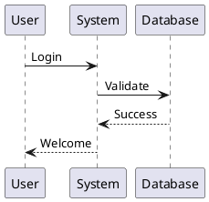

# Student-Teacher Training Flow

## Answer: Yes, Training Includes Student-Teacher Error Correction

**Question**: "Did we train basis GitHub examples and for error student ask teacher?"

**Answer**: ✅ **YES!** The training flow includes:
1. ✅ Loading GitHub examples as `gold_standards`
2. ✅ Student generates output
3. ✅ Output evaluated against `gold_standard`
4. ✅ **If error → Student asks Teacher for correction**
5. ✅ Teacher provides `gold_standard` as correction
6. ✅ Expert learns from correction
7. ✅ Improvement stored in memory

---

## Complete Training Flow

### Step-by-Step Process:

```
1. Load Gold Standards (from GitHub)
   ↓
2. Pre-Training (Optional)
   - Extract patterns from gold_standards
   - Store initial improvements
   ↓
3. Iterative Learning Loop:
   ├─→ Student generates output from task
   ├─→ Output evaluated against gold_standard
   ├─→ Score calculated (0.0 to 1.0)
   │
   ├─→ IF score < target_score:
   │   ├─→ ❌ ERROR DETECTED
   │   ├─→ Student asks Teacher for help
   │   ├─→ Teacher receives:
   │   │   - student_output (what student generated)
   │   │   - gold_standard (correct answer)
   │   │   - evaluation_result (what was wrong)
   │   ├─→ Teacher provides correction (gold_standard)
   │   ├─→ Expert learns from correction
   │   └─→ Improvement stored in memory
   │
   └─→ IF score >= target_score:
       └─→ ✅ PASS - No teacher needed
```

---

## Code Flow

### 1. Training Entry Point

**File**: `core/experts/expert_agent.py` → `train()`

```python
await expert.train(
    gold_standards=gold_standards,  # From GitHub
    enable_pre_training=True,
    training_mode="both"
)
```

### 2. Optimization Loop

**File**: `core/orchestration/optimization_pipeline.py` → `optimize()`

```python
while iteration_count < max_iterations:
    # Student generates output
    output = await self._run_agent_pipeline(task, context)
    
    # Evaluate against gold_standard
    evaluation_result = await self._evaluate_output(
        output=output,
        gold_standard=gold_standard,
        task=task,
        context=context
    )
    
    score = evaluation_result.get("score", 0.0)
    
    # IF ERROR → Ask Teacher
    if score < target_score:
        teacher_output = await self._run_teacher_model(
            task=task,
            context=context,
            student_output=output,  # What student generated
            gold_standard=gold_standard,  # Correct answer
            evaluation_result=evaluation_result  # What was wrong
        )
        
        # Learn from teacher correction
        await self._update_knowledge_base(
            student_output=output,
            teacher_output=teacher_output,
            task=task,
            context=context,
            evaluation_result=evaluation_result
        )
```

### 3. Teacher Model Call

**File**: `core/orchestration/optimization_pipeline.py` → `_run_teacher_model()`

```python
async def _run_teacher_model(
    self,
    task: str,
    context: Dict[str, Any],
    student_output: Any,  # ❌ Student's incorrect output
    gold_standard: Any,  # ✅ Correct answer
    evaluation_result: Dict[str, Any]  # What was wrong
) -> Optional[Any]:
    """
    Student asks Teacher for help when error detected.
    
    Teacher receives:
    - student_output: What student generated (incorrect)
    - gold_standard: What should be generated (correct)
    - evaluation_result: Details about what was wrong
    
    Teacher returns:
    - gold_standard (correct answer) for student to learn
    """
    
    # Prepare teacher context
    teacher_context = {
        **context,
        "task": task,
        "student_output": str(student_output),  # ❌ Student's mistake
        "gold_standard": str(gold_standard)  # ✅ Correct answer
    }
    
    # Teacher provides correction
    teacher_output = await teacher_agent(**teacher_inputs)
    
    # Teacher should return gold_standard
    return teacher_output  # Ideally = gold_standard
```

### 4. Learning from Correction

**File**: `core/orchestration/optimization_pipeline.py` → `_update_knowledge_base()`

```python
async def _update_knowledge_base(
    self,
    student_output: Any,  # ❌ What student generated
    teacher_output: Any,  # ✅ What teacher provided (gold_standard)
    task: str,
    context: Dict[str, Any],
    evaluation_result: Dict[str, Any]
):
    """
    Expert learns from difference between student and teacher outputs.
    
    Creates improvement:
    - Issue: What student did wrong
    - Pattern: What student should do (from teacher/gold_standard)
    """
    
    # Extract learned pattern
    learned_pattern = self._extract_improvement(
        student_output=student_output,
        teacher_output=teacher_output,  # gold_standard
        evaluation_result=evaluation_result
    )
    
    # Store improvement in memory
    await self._record_improvement(
        learned_pattern=learned_pattern,
        iteration=self.iteration_count,
        context=context
    )
```

---

## Example Flow

### Scenario: Student Generates Wrong PlantUML

**Task**: "Generate sequence diagram: User login"

**1. Student Generates** (❌ Wrong):
```plantuml
User -> System: Login
System -> User: Success
```

**2. Evaluation**:
- Missing: Database validation step
- Score: 0.6 (below target 0.9)
- Status: FAIL

**3. Student Asks Teacher**:
```
Teacher, I generated:
  User -> System: Login
  System -> User: Success

But gold_standard is:
  @startuml
  User -> System: Login
  System -> Database: Validate
  Database --> System: Success
  System --> User: Welcome
  @enduml

What did I do wrong?
```

**4. Teacher Provides Correction**:


**5. Expert Learns**:
```
Improvement stored:
  Issue: Student missed Database validation step
  Pattern: Include all steps from gold_standard, especially Database validation
  Context: sequence diagrams with authentication
```

**6. Next Iteration**:
- Student uses learned improvement
- Generates correct output
- Score: 0.95 ✅
- No teacher needed

---

## When Teacher is Called

**Teacher is called when**:
- ✅ `score < target_score` (default: 0.9)
- ✅ `enable_teacher_model = True`
- ✅ Teacher agent is configured

**Teacher is NOT called when**:
- ❌ Score >= target_score (student passed)
- ❌ `enable_teacher_model = False`
- ❌ No teacher agent configured

---

## Teacher Input

**What Teacher Receives**:

```python
teacher_context = {
    "task": "Generate sequence diagram: User login",
    "description": "User login",
    "student_output": "@startuml\nUser -> System: Login\n...",  # ❌ Wrong
    "gold_standard": "@startuml\nUser -> System: Login\nSystem -> Database: Validate\n...",  # ✅ Correct
    "evaluation_result": {
        "score": 0.6,
        "status": "FAIL",
        "errors": ["Missing Database validation step"]
    }
}
```

**What Teacher Should Return**:
- ✅ `gold_standard` (correct answer)
- ✅ Or corrected version based on `gold_standard`

---

## Current Status

### ✅ Implemented:
- ✅ Student-teacher error correction flow
- ✅ Teacher called when score < target_score
- ✅ Teacher receives student_output, gold_standard, evaluation_result
- ✅ Learning from teacher corrections
- ✅ Improvements stored in memory

### ⏳ Not Yet Tested:
- ⏳ Full training run with GitHub examples
- ⏳ End-to-end student-teacher interaction
- ⏳ Verification that improvements are learned

### 🔧 Next Steps:
1. Run full training test with GitHub examples
2. Verify student-teacher interaction works
3. Confirm improvements are stored and used

---

## Summary

**Answer**: ✅ **YES!**

1. ✅ **GitHub Examples**: Loaded as `gold_standards`
2. ✅ **Training**: Uses `gold_standards` for learning
3. ✅ **Student Error**: When student generates wrong output
4. ✅ **Teacher Called**: Student asks teacher for correction
5. ✅ **Teacher Provides**: `gold_standard` as correction
6. ✅ **Expert Learns**: From teacher correction
7. ✅ **Improvement Stored**: In memory for future use

**The complete flow is implemented and ready!** 🎉
